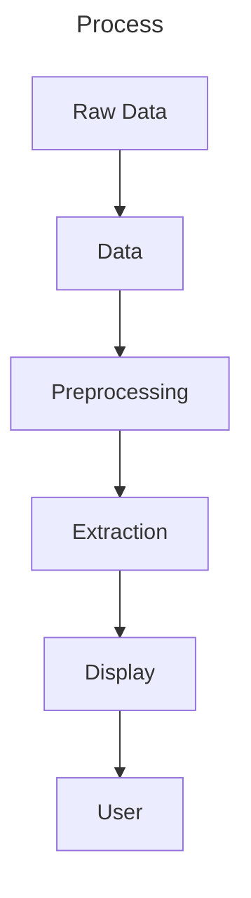

# Visualization Part 1

## The Process

### Part 1 - Data

+ Source data.
+ Any kind.
+ We rarely have control over the data format.
+ Often, raw data is not in the format we need.
+ May need to combine multiple sources of data.

### Part 2 - Preprocessing

+ Preferably, model data on a grid.
+ If irregularly distributed, interpolate onto regular grid.

### Part 3 - Extraction

+ Extract parts we care about.
+ Simple or complex depending on what we want.
+ Can generate another output file.

### Part 4 - Display

+ Convert extracted data into graphical representation.
+ May need to map data to geometry or something else we can display.
  - Mapping called **Visualization Techniques**.
+ Is the visualization interactive? How can the user interact?

## The Large Scale

+ Above is the classical view.
+ Fine for small amounts of data (can be processed on one non-supercomputer
  machine.)
+ Supercomputers have thousands of CPUs/GPUs.
+ Can generate large amounts of data quickly.
  - Hard to save data to disk, can take long time.
+ Data sets are now too large for a single workstation to handle.

## In-Situ Visualization

+ Build visualization while computation is running.
+ Send results to other workstation.
+ Reduces amount of data to transmit.
+ Reduces amount of data to save.

## Computational Steering

> Ability to control the computation while it is running.

+ Interact with visualization as it is running.
+ Change parameters to visualization as it runs.
+ Ability to see if visualization has gone wrong or there is something
  interesting to explore.
+ Gives chance to take action before computation finishes, saving time.

## Particle Tracing

+ Compute motion of particle.
+ Save samples of particle path to file.
+ How many paths do we trace?
  - Trial and Error?
+ How do we generate the initial particle position?

### Seeding

+ Generating initial positions for particles.
  1. Random positions
  2. Know locations of interesting features? Generate random positions along
     this feature (within sphere, along line, etc.)
  3. Automatic selection - dependent on what we are visualizing.
+ **Path Termination**
  - Particle velocity is close to 0.
  - Particle moves outside velocity field.
  - Path has reached maximum length.
  - Maximum number of time steps reached.
