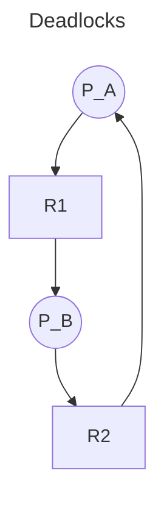

# CPU Scheduling

## The CPU-I/O Burst Cycle

During a CPU burst, the CPU performs computations that don't rely on I/O. Each
CPU burst can be of arbitrary length, but is usually followed by an I/O burst.
I/O bursts are sections of time where the CPU waits for I/O (Though, the CPU
_could_ swap processes at this time to keep itself busy.) Our concern is to
distribute CPU bursts efficiently.

## CPU Scheduler

Selects processes among those in the ready queue, and allocates them CPU time.
Scheduling decisions may take place when a process:
1. Switches from running to waiting state
2. Switches from running to ready state
3. Switches from waiting to ready
4. Terminates

## Criteria & Good Things

**CPU utilization** – We want to max this. Keep the CPU as busy as possible.  
**Throughput** – We want to max this. # of processes that complete their
execution per time unit.  
**Turnaround time** – We want to min this. Amount of time to execute a
particular process.  
**Waiting time** – We want to min this. Amount of time a process has been
waiting in the ready queue.  
**Response time** – We want to min this. Amount of time it takes from when a
request was submitted until the first response is produced, not output (for
time-sharing environment). wait time + response time.

## CPU Scheduling Algos

+ First Come First Serve - Non-preemptive, processes are run until finished.
+ Shortest Job First - Needs to know CPU burst time of process.
+ Priority Scheduling - Smallest integer means highest priority. Possible
  "starvation": Low priority tasks may never execute. the solution? Aging:
  priority increases w/ time.
+ Round Robin - Round robin. 1/n of CPU time for n processes in chuncks of q
  (usually 10-100ms.) Preemptive.
+ Multi-Level Queue Scheduling - Ready queue is partitioned into separate
  queues, e.g.:
  - foreground
  - background  
  Processes are permanently in a given queue. Each queue has its own scheduling
  algorithm:
  - Foreground – Round Robin
  - Background – FCFS (FIFO)  
  Plus scheduling between queues (e.g. fixed priority (foreground first, then
  background), timeslice (70% fg, 30 bg))

## common priority levels for multi-level queue scheduling

1. system
2. interactive
3. interactive editing
4. batch
5. student

## Real Time CPU Scheduling

+ **Soft Real-Time** - No guarantee when critical real-time processes will be
scheduled and finished.
+ **Hard Real-Time** - Task must be serviced by deadline.

The following types of latencies can affect performance of real-time systems:
+ **Interrupt latency** – Time from arrival of interrupt to start of routine
  that services the interrupt.
+ **Dispatch latency** – Time for the scheduler to take the current process off
  the CPU and switch to another.

## Earliest Deadline First Scheduling

A real-time scheduling algorithm. Priorities are assigned according to
deadlines: The earlier the deadline, the higher the priority; the later the
deadline, the lower the priority.

# Deadlocks

Cyclic waiting on resources used by processes.

Four conditions are required for Deadlocks to occur:
+ **Mutual Exclusion** of resources.
+ **Hold and Wait** - A process w/ a resource waits for another resource held
  by some other process.
+ **No Preemption** - Resources can only be released voluntarily after a
  process has completed its task.
+ **Circular Wait** - see first sentence of this section.

## Handling Deadlocks

We look at three different ways to handle deadlocks:
+ Ensure the system never enters a deadlock state.
  - Through deadlock prevention.
  - Through deadlock avoidance.
+ Allow the system to enter a deadlock state, then recover.
+ Ignore the problem; protend it doesn't exist.

### Deadlock Prevention

To manage:
+ **Mutal Exclusion** - It is only necessary for non-safely sharable resources.
+ **Hold and Wait** - Guarantee that whenever a process requests a resource, it
  does not hold any other resource (or have all resources allocated to it prior
  to execution.) This has the potential to cause low resource utilization.
+ **No Preemption** - If a process requests a resource while it holds another,
  release _all_ resources that process holds.
+ **Circular Wait** - Impose total ordering, blah, blah, yada, yada.

### Deadlock Avoidance

Smart(er) allocation of resources to processes to avoid deadlocks.
+ Processes are in a **safe state** if it is possible for them to complete
  using the available resources.
+ Processes are in an **unsafe state** if it is not possible for them to
  complete using the available resources.

Consider the following process/resource matrix:

|Process|X Resource Held|X Resource Required|Y Resource Held|Y Resource Required|
|------:|:-------------:|:-----------------:|:-------------:|:-----------------:|
|A|1|8|2|9|
|B|2|6|3|9|
|C|2|6|2|3|

Available X Resources: 4  
Available Y Resources: 4

Is the system above, as a whole, in a safe state? Answer: Yes, the "safe state
sequence" is C -> B -> A.

### Deadlock Recovery

Deadlocks are allowed to happen. Apropriate actions are taken to recover from
the deadlock state. Given a graph of processes and the resources they
hold/request, if the graph contains a cycle, we have a deadlock. We talk about
three ways of recovering from deadlocks:
+ **Preemption** - Preemptive resources (resources that can be taken away) are
  given to a process that requests them from a process that currently holds
  them.
+ **Rollback** - Each process is check-pointed. The state of both processes and
  resources are saved. When a deadlock ocurrs, recover to a previous checkpoint.
+ **Killing (Processes)** - Processes holding contested resources will be killed
  so other processes can use those resources.

### Deadlock Ignorance

Simply ignore the possibility of deadlocks. In systems where deadlocks are
rare, this is a valid strategy.
