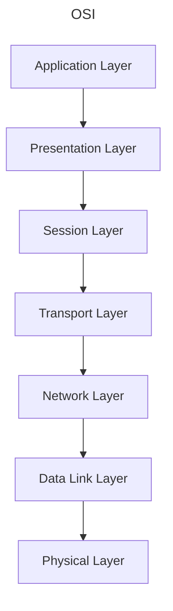

# Networking - Models

The OSI Reference Model (for fun!):

## Signals

Different modulation schemes are used to encode data over signals. Signals can
be multiplexed to share it among multiple users. There are two types of signals
used in networks:
+ Digital
+ Analog

## Digital Signals

+ Discrete values
+ Consist of "On/Off" or 1/0.

We look at two different encoding techniques:
+ **Current State Encoding**.
+ **State-Transition Encoding**.

## Current State Encoding

Data is encoded by the presence or absence of a signal. 3 types:
+ **Unipolar**.
+ **Polar**.
+ **Return to zero**.

### Unipolar

One polarity (positive or negative) is used. The middle zero state represents
a binary 0 while the positive/negative polarity represents a binary 1 (or
vice-versa).

### Polar

Similar to unipolar except both poles are used. Either positive or negative can
represent binary 1 (or 0.)

### Return to Zero

After the transmition of each _bit_, the voltage returns to 0. The zero state
is considered a rest state.

## State-Transition Encoding

Data is encoded by the _transition_ of a high voltage to a low voltage (or
vice-versa.) The transition is observed _mid bit_.

### Manchester

Transition form high to low is 1, low to high 0 (or vice-versa.)

## Analog Signals

Electro-magnetic waves! Sine waves! There are two types of modulation
techniques we look at:
+ **Amplitude Modulation** - The amplitude of the wave encodes the bit value.
  For example: Higher amplitudes encode a 1, while lower amplitudes encode a 0.
+ **Frequency Modulation** - The frequency of the wave encodes the bit value.
  For example: Higher frequencies encode a 1, while lower frequencies encode a
  0.

## The Data Link Layer

This is where bits are framed into packets and hardware level addressing (e.g.
MAC addresses) ocurrs. And, importantly, Error detection and correction.

## Parity Checks

+ Considered the simplest form of error detection.
+ Two types:
  - Even parity.
  - Odd parity.

### Even Parity

The number of on bits in a chunk of data is checked. If odd, the additional
parity bit at the end of the data is set to 1. If even, the additional parity
bit is set to 0.

### Odd Parity

The opposite of even parity. We check the number of on bits and set the parity
bit so that the number of 1s is odd.

## Checksums

Changing an even amount of bits in the data can fool our parity checks. The
simple checksum is an improvement over flimsy parity checks:
1. Consider all the "words" in the chunk of data to checksum.
2. Sum them all up.
3. Take the 1's complement (binary NOT).
4. Send the original data along with the 1's complement of the sum.
5. On the receiver side, take the sum of the words in the received data. Add
   the checksum (the 1's complement sent by the sender) and check that the
   result contains all bits set to 1.

## The TCP Model Exists!

## IP Addresses

IP Addresses are allocated in blocks called "prefixes". The prefix refers to
the network portion of an IP address. It is followed by the host portion.
You'll occasionally see IPv4 address written in the 192.168.0.1/24 notation.
The `/24` part specifies how large the network portion is in terms of bits. The
corresponding subnet mask has the same number of 1 bits.

### Classful Addressing

Older addresses came in blocks of fixed size:
+ Class A - For regular use.
+ Class B - For regular use.
+ Class C - For regular use.
+ Class D - For **multicast**.
+ Class E - Reserved.

The class of an IP Address can be determined from the number of consecutive 1
bits at the beginning of the address:
+ 0 consecutive 1s: class A.
+ 1 consecutive 1s: class B.
+ 2 consecutive 1s: class C.
+ 3 consecutive 1s: class D.
+ 4 consecutive 1s: class E.

## IPv4 Header

**IHL** - Internet Header Length. The size of the internet header in 32-bit
words.

**Differentiated Services** - Specifies the differentiated service this packet
is for. Includes _Explicit Congestion Notification_.

**Total Length** - Size of the entire packet.

**Identification** - Used for uniquely identifying the group of fragments for a
single IP datagram.

**DF** - Don't Fragment. Do not fragment the packet. The packet is dropped if
fragmentation is required to route the packet.

**MF** - More Fragments. For fragmented packets, all fragment except the last
have this flag set.

**Fragment Offset** - Offset of a fragment relative to the beginning of the
original IP datagram. Specified in units of 8 bytes.

**Time To Live** - In practice, hop-count.

**Protocol** - Protocol used in the data portion of the IP datagram.

**Header Checksum** - Checksum for the header only.

**Options** - Optional parameters.

## IPv6 Header

**Traffic Class** - Contains both the Differentiated Service field and the
Explicit Congestion Notification field.

**Flow Label** - An identifier for a group of packets.

**Payload Length** - Size of the payload in octets. Includes extension headers.

**Next Header** - Type of the next header. Usually the transport layer protocol
used by the packet's payload.

**Hop Limit** - A.K.A. Time to Live.
