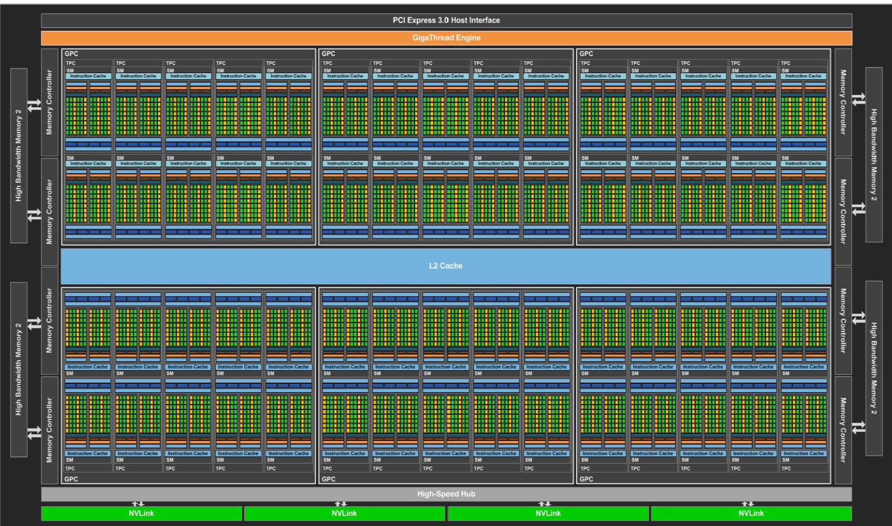
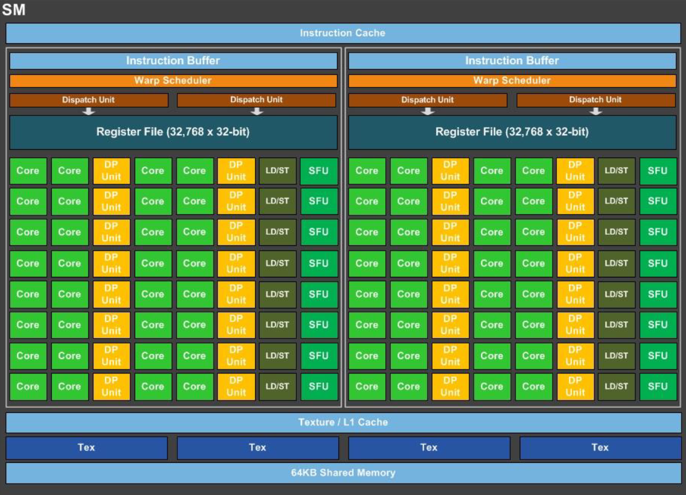
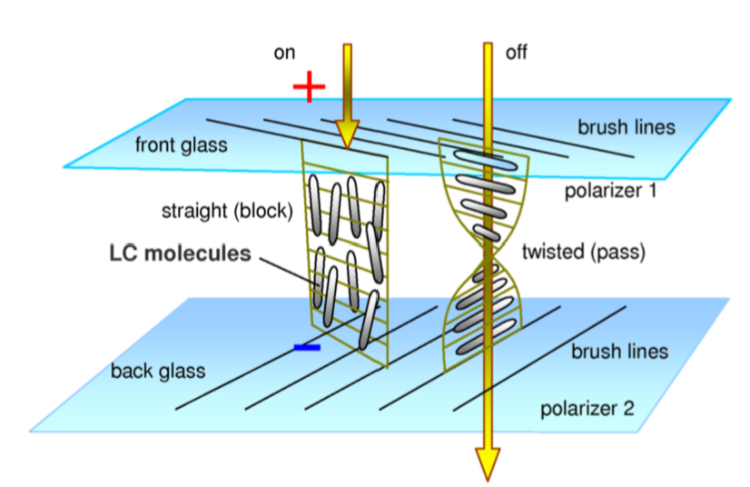
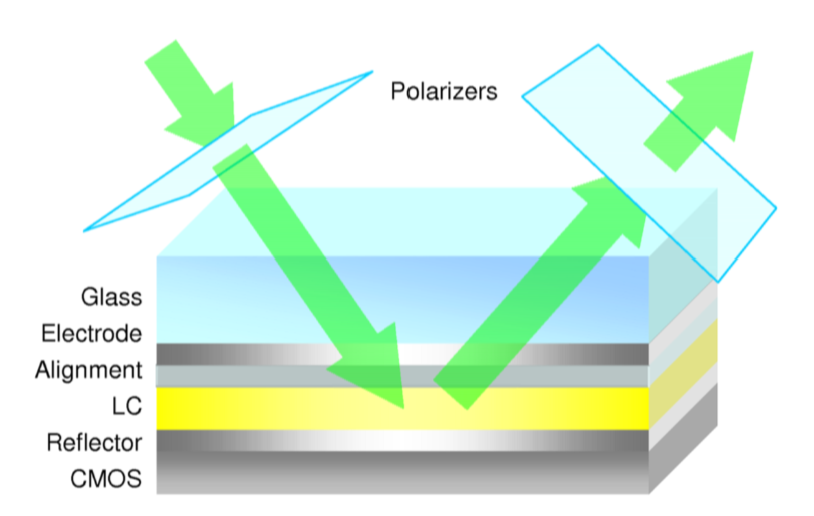

# Graphics Hardware - Part One

(Extremely) high-level view of hardware:


## Memory

Note: numbers may be outdated.

+ CPUs work directly on data within registers.
+ Register work as quickly as the CPU. No delay in access.
+ Followed by L1 cache.
  - Near CPU speed. Little delay.
  - Feeds CPU registers.
  - One for data and one for instructions
+ Then L2 cache.
  - Feeds L1 cache.
  - Slower, ~order of magnitude.
  - Larger than L1 cache.
+ Some systems have an L3 cache.
  - Again, larger but slower.
  - Multiple MegaBytes
+ Lastly, there is DRAM.
  - Very large storage.
  - Much slower.

### Cache Lines

```admonish danger
This information is important when optimizing code.
```

+ CPU caches are organized as cache lines.
  - 64 or 128 bytes of contiguous memory.
+ A cache line is the basic amount of data that will be transferred at a time.
+ Most data types are multiple bytes large.
  - We'll access these bytes together.
  - So they should fit in a single cache line.
  - If data is not "aligned" to a cache line boundary, we may have to transfer
    an additional cache line worth of bytes to load the data.
    * Consider a double (8 bytes) where the middle bytes cross a cache line
      boundary.

## DRAM

+ Large and cheap.
+ Optimized for size not speed.
+ A DRAM Cell stores 1 bit.
  - Stores the bit for 30 to 100 milliseconds.
  - Contents must be refreshed regularly.
+ Chips are typically organized as a 2D array of cells.
  - You retrieve a row at a time.
  - The retrieved row is stored in a fast row buffer on DRAM.
    * First read of a row is slow, subsequent reads are faster.
      - Could be 10x faster.
    * Allows adjacent bits to retrieved quickly.
+ Reads are destructive.
  - Contents of row buffer must be written back to memory.
+ Designed to feed caches.
+ **Don't** jump all over DRAM.

So:
+ Avoid referencing DRAM if possible.
+ Reference contiguous locations.
+ Align data to cache lines.
+ Make data structures as compact as possible.
+ Group items of the same type (really size) together.

## CPU

+ Double CPU speed every so often
  - VLSI (manufacturing) improvements.
+ Smaller components -> faster chips.
  - ~4GH is upper limit.
  - Problematic quantum effects start to matter.
  - Harder to cool the smaller surface area.
+ Chip area is still usable.
  - Could increase cache sizes but has limits.

+ Solution: Multiple cores
  - Slower processors, but collectively more power.
  - Initially, issues with cache design. <- Don't really need to worry about it in this course.
  - Problem is now developing parallel programs.

+ Ray tracing is good example of parallel programming.
  - _Primary_ rays are independent.
  - Very close to linear scaling.
+ Tools:
  - Low level threads.
    * Good control.
    * Good performance.
  - Open MP.
    * Compiler extension.
    * Easy to learn.
    * Compiler switch available to turn on/off for debugging.
    * Use `#pragma` statements to suggest parallelism.
      ```cpp
        #pragma omp parallel for private(i, j)
        for (i = 0; i < N; i++)
          for (j = 0; j < M; j++)
            ...
      ```

## Graphics Card

```
flowchart LR
  B["Bus Interface"]
  R[DRAM]
  G[GPU]
  V[Video]

  B <--> R
  R <--> G
  B <--> G
  G --> V
```

### Bus Interface

+ PCIe.
+ Transfer data to/from GPU.
+ Want to store as much as possible on the GPU.
  - This is, in part, controlled by the driver.
  - Try not to thrash between GPU and Main memory.

+ Alternatively, the GPU can be on the same chip as the CPU.
+ CPU and GPU now share same memory.
  - Increased bandwidth.
  - AMD APUs.

### GPU DRAM

+ Most space on GPU is devoted to processors.
  - External memory needed.
+ Either standard DRAM chips or GDDR chips.
+ GDDR uses same memory cells as DDR3. (<- up to date?)
  - Different bus interface.
  - GPU memory doesn't co-exist with other devices.
  - Fewer constraints than DDR.
  - Much wider data bus for greater bandwidth.
  - Higher clock speeds and better clock management.
+ GPUs transfer large chunks of contiguous memory.
  - GDDR has deeper row buffers.
  - The GPU is more likely to request adjacent rows of memory.

### Video (Output)

+ To display, we need to encode the frame buffer into a video signal.
+ In early graphics systems:
  - Both GPU and video circuits accessed same memory.
  - They had to share bandwidth.
  - Early solution was VRAM with two data ports:
    * Standard memory port for GPU.
    * Shift register based port for video circuits.
  - Both ports acted independently.
    * Video circuits accessed a row of pixels at a time.
    * Thus shift registers made sense.
+ Modern graphics systems:
  - Use double buffering and etc.
  - Ping pong chips between GPU and video circuits.
  - Multiple displays can be assigned different areas of memory.

### Video Standards

VGA:
+ Analogue.
+ R, G, and B.
+ Horizontal sync.
+ Vertical sync.

DVI:
+ Analogue & Digital.
+ Different "versions".
  - Connectors have same basic shape but different pins and capabilities.

HDMI:
+ More standard connector shape.
+ Wider range of signals (including Ethernet!)
+ Two-way communication (HDMI CEC).

Display Port:
+ Designed as replacement for HDMI.
+ Smaller sized than HDMI.

USB-C:
+ Can carry video signal.
  - e.g. HDMI or Display Port.
+ Both cable and connector spec not video.

### GPU

+ "Wheel of Reincarnation" - Graphics architectures repeat themselves over time.
+ Special purpose hardware gives more performance for lower price.
  - Trade-off between flexibility and performance.

SGI:
+ Silicon Graphics (company).
+ Saw lots of floating point computation in graphics.
+ Developed Geometry engine.
  - Computations in hardware.
  - The first company to do this.
+ Much cheaper than competition.
+ As hardware evolved, chips became programmable.
  - By hardware engineers not end users.

NVidia:
+ 1990s startup.
+ Developed graphics hardware.
  - Again much cheaper than competition (e.g. SGI).
+ Started with support for 2 textures.
  - Wanted to simultaneously use more.
+ Introduced programmable fragment shaders.
  - Initially simple, only small programs.
  - Assembly level programming.
  - Initially no branching.
  - Program applied to multiple fragments in parallel.

+ Eventually introduced programmable vertex processor.
  - Different instruction sets to fragment processor.


+ Eventually branching instructions added.
+ Longer more complicated programs.
+ Two seperate ISA (vertex + fragment processor) converged.
+ High level languages:
  - NVidia Cg.
  - OpenGL GLSL.

The modern state:
+ New problem:
  - Dedicated vertex/fragment processors.
  - If we have a lot of fragment work, vertex processors are idle.
    * And vice versa.
+ Solution: One set of processors to dynamically allocate where needed.
  - Processors can handle either vertex or fragment work.
+ Data cycles through the GPU.
  - Starts with vertex programs.
  - Output is pumped back through chip as input to fragment programs.
+ Other types of shaders can be introduced:
  - Geometry.
  - Tessellation.
  - Computation.

## GPU Architecture



NVidia Pascal (GP100):
+ Mostly computational cores (3840 of them).
+ **SIMD** - Cores are a SIMD architecture.
  - _One_ instruction decode unit **for a group of 32** cores.
  - All cores perform the same instruction in lock step.
+ Instruction decode on CPU is complicated.
+ Instruction decode on GPU is much simpler.
+ The SIMD unit with 32 processors is called a **streaming multiprocessor (SM)**.
+ SMs are grouped into GPC (Graphics Processing Cluster).
+ GP100 organizes SMs into 6 GPCs.
  - New level of organization for NVidia chips.



## SIMD

+ Consequences abound.
+ Many cores execute the same instruction in parallel.
+ Problem for control structures.
+ `if` statement:
  - Each core evaluates the condition.
  - Each core is marked as true or false.
  - Execute true cores then false cores _serially_.
  - On average, half of the cores will be idle during execution of an `if`.
+ `while` loop:
  - Each core will evaluate the loop condition.
  - If even one core is still looping, the others must wait.
  - Possibly result in large number of idle cores.
+ `for` loop:
  - Not an issue since loop count is fixed.

## Back to GPU Architecture

GP100:
+ New memory organization.
  - Memory chips are stacked on top of each other.
  - ~4 dies in each stack, significantly increasing memory bandwidth.
  - e.g. ~300 GB/s on previous architectures to ~720 GB/s.

Turing:
+ Another significant evolution.
+ Floating point and integer units can work in parallel.
+ Tensor cores used for machine learning.
+ RayTracing core.
  - Ray-triangle intersections.
  - Bounding volume hierarchies.
+ A program on an SM can spawn other programs.

ADA:
+ Even more cores.
+ 12 GPCs
  - 12 SMs per GPC.
+ Improvements to tensor and ray tracing cores.
+ Tensor and Ray-Tracing cores require special programming.
  - i.e. Taking these cores into account.
+ Some indications that bottleneck problems are starting to appear.
  - Between Ray-Tracing cores and the rest of the SM.

## Tiled Architectures

+ Mobile devices.
  - Power usage is concern.
+ Tendency to write to same location many times.
  - Too much DRAM access.
+ Solution: **Tiled Rendering**
  - Divide screen into tiles.
  - Each tile is small enough to fit onto on-chip memory.
  - **Binning** - Sort triangles into tiles.
  - Process one tile at a time.
    * Run complete pipeline on each triangle.
  - Write finished tile to DRAM.
+ Each triangle may be processed many times.
  - Done on chip so it is fast despite being not optimal.
+ In some cases, triangles are sorted to optimize hidden surface.
  - z-buffer is kept on-chip.
+ **Deferred Rendering**: Do not run entire frag shader until certain fragment
  will be displayed.

## Displays - SLMs

**Spacial Light Modulators (SLM)**:
+ Dynamically changes (modulates) the optical properties of individual pixels.

### LCD

+ Most common SLM.
+ Works by changing the polarization of light.
+ **Linear polarization**: Light waves in only one orientation.
+ Polarizers on both ends of the panel.
  - Thin sheets that pass light of only one polarity.
  - Select light with a particular polarization.
+ Can also have optical elements that change the polarization.
+ Liquid Crystals (**LC**D) are long molecules that can be aligned by applying
  a voltage, this changes their optical properties.
  - Arranged in small cells with three cells per pixel.
+ See next image:
  - On left, positive voltage is applied and the light is blocked.
  - On right, no voltage, light passes through cell, but polarization is changed.
    * LCD is basically transparent.



+ An LCD has a backlight that provides the light needed to see.
+ Mainly LED backlights.
+ Backlight should be even to avoid intensity variations across display.
+ Can use more than one LCD panel.
  - Each panel can do 256 level of red, green, and blue.
+ Stack 2 panels and get $256^2$ levels for each of red, green, and blue.
  - This is **HDR**.
+ First LCD panel (closest to backlight) becomes a _pixel accurate_ variable
  backlight.
+ An LCD is called a **transmissive SLM** since it modifies the light that
  passes through it.

### Reflective Displays

+ Change the light reflected off of an SLM.

**LCoS (Liquid Crystal on Silicon)**:
+ A reflective surface is placed on top of a CMOS chip.
+ A Coating of liquid crystal on top of the reflective surface.
+ Charges applied to the liquid crystal coating change its polarizing
  properties and whether light is reflected.
+ No need for backlight
+ Smaller pixels.
+ F-LCoS: Even smaller pixels for head-mounted displays.
+ Also used in projectors.



**DMD (Digital Micromirror Devices)**:
+ Uses very small mirrors on a silicon chip.
+ Mirrors can move (orientate).
  - In one configuration: The mirror reflects light towards the viewer.
  - In another: Light can be reflected away from viewer.
  - Can get grey by controlling the amount of time the mirror points towards
    the viewer.
+ Switch/Orientate much faster than LCDs.
+ Very efficient.
  - Little light loss in reflection.
+ Used in projectors.
+ Low end DMDs produce colour by displaying red, green, and blue sequentially.
+ High end uses three DMDs per pixel and combines the three images.
  - Used in movie theatres.

