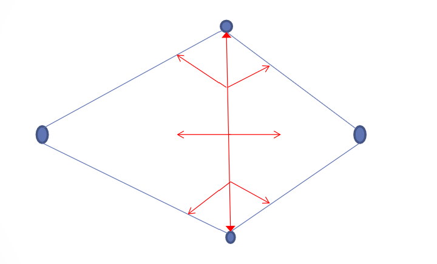
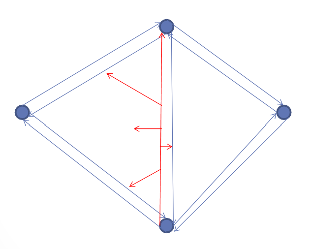
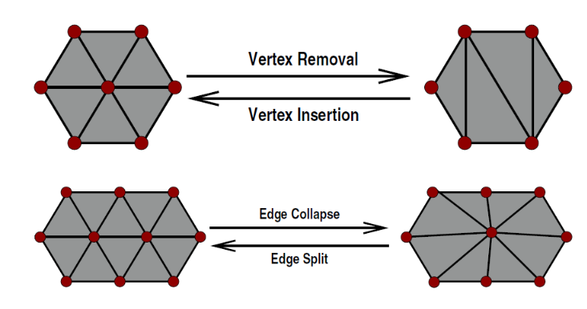

# Polygon Meshes

## 3D Scanners

+ Common source of 3D models.
+ Two main categories:
  1. Stationary.
  1. Hand held.
+ With stationary scanners, the object is placed on a rotating platform.
  - Distance to the object is measured with a sensor.
  - Results in a 3D point cloud.
  - Object can only be as big as the scanner allows.
+ Hand held scanners have no restriction to the size of objects.
  - Use sensors to determine position _and_ orientation to produce points.
+ Many algorithms to convert point clouds to polygonal meshes.
+ For stationary scanners you get a ring of points:
  - Produce triangles connecting adjacent rings.
  - Iterate one ring at a time.
+ Issues for the above include:
  - Rings that are close together generate _lots_ of polygons.
    * Could use **decimation**: Replace many small triangles with one bigger one.
  - How do we handle branching objects (consider a wish bone.)
    * ??? (We didn't go over it.)

## Polygon Data Structures

+ Indexed face sets and polygon soup are good for display, but not other operations.
  - Can represent non-manifold surfaces.
  - Hard to determine connectivity information.
+ Edge based data structures solve these problems.
  - Polygons are viewed as a list of edges.
  - Each edge has 2 vertices.
  - Each edeg belongs to 2 faces.
  - Based on three tables:
    * Vertex.
    * Edge.
    * Face.

## Winged Edge

+ Stores the following for each edge:
  - 2 vertices.
  - The 2 faces it belongs to.
  - The next edge _for each face_.
  - The previous edge for each face.
+ Each vertex stores:
  - Its position.
  - A pointer to one of its edges.
+ Each face stores:
  - A pointer to one of its edges.
+ To draw a face:
  - Follow its edge pointer to the first edge.
  - Collect the next vertex from that edge.
  - Follow the edge's pointer to the next edge.
+ To find all polygons that share a vertex:
  - Follow the vertex's edge then face pointer in a loop.
    * Picture a triangle fan.
+ Neighbourhood and connectivity information is quick to query.

## Half Edge

+ One issue with winged edge is knowing which of the two pointers to follow (next or prev?)
  - There are two for each edge.
  - Which entry belongs to which face?
+ Solution: **Half Edge** data structure.
+ Each edge is split into two directed half edges.
  - Each stores half of the edge information.

## Edge Data Structures

+ Support efficient algorithms for connectivity and neighbours.
+ Cannot create non-manifold surfaces.
+ Significantly more storage space required.
+ Popular for CAD programs.
+ To convert an indexed face set into an edge data structure:
  - Traverse vertices around a polygon.
    * Construct an edge for each pair.
  - For each vertex, record the newly constructed edge.
  - When the same vertex pair is encountered a second time:
    * construct the other half of the edge.
  - If the same edge is encountered more than twice, we have a non-manifold
    surface which is an error.

## Triangles

+ Simple.
+ Always planar.
  - Needed by many algorithms, including displaying.
+ Hardware is optimized for triangles.
+ Can convert other polygons to triangles.
+ Can simplify and optimize data structures for it.

How do we get non-planar polygons?
+ Bad data.
+ Incorrect algorithms.
+ Text file formats that truncate coord values.
+ Rounding errors.
+ We can check for non-planar polygons (quads, etc.) by checking against the
  plane equation $Ax + By + Cz + d = 0$
+ Substitute a vertex into the equation to check if it is on the plane.
+ If not, move along the normal in the appropriate direction until it is on the plane.
+ The plane equation can be stored with the polygon or computed.

### Barycentric Parameterization

+ $B$, $C$, and $D$ are the triangle vertices.
+ Point $p$ on the surface is expressed:
  $$
  p(\alpha, \beta, \gamma) = \alpha B + \beta C + \gamma D
  $$
+ $\alpha, \beta, \text{and} \gamma \ge 0$
+ $\alpha + \beta + \gamma = 1$
+ Also makes point intersection detection easy.

## Differential Geometry

+ Don't have smooth surfaces with polygonal meshes.
  - Polygonal meshes are a piecewise linear approximation to smooth surfaces.
+ How do we get normal vectors, tangent vectors, and curvature?
+ The normal:
  - Compute average based on the vertices in the neighbourhood.
    * **One ring neighbours** are the other verticies of all the triangles this
      vertex belongs to. (picture a triangle fan.)
    * This works well for meshes with little noise.
    * Use larger neighbourhoods otherwise.
  - One ring neighbourhood can be used to compute the normal.
  - Compute the triangle normal by taking the cross product of two of its edges.
    * Do this for the entire one ring neighbourhood.
  - Take the (possibly weighted) average of all polygons.
  - Possible weights include:
    * A constant, usually 1.
    * The area of the triangle (magnitude of the cross product used for the normal.)
    * The angle that the triangle makes at the vertex (works best).
+ How do we get the gradient for a value within the triangle?
  - Sum the products of the verticies with the gradient of Blending functions.
    * $\nabla f(u) = f_i\nabla B_i(u) + f_j\nabla B_j(u) + f_k \nabla B_k(u)$
  - Each vertex has its own blending function.
  - Since the triangle is flat, the gradients of the blending functions will sum to 0.
  - This allows getting rid of one of the terms.
+ How do we get curvature?
  - Use the Laplace-Beltrami operator: $\Delta$.
    * Essentially gives us the second derivatives.
    * Lots of math.
  - Can derive the mean, gaussian and two principle curvatures.

# Polygon Mesh Processing

## Mesh Smoothing

+ 3D scanners can introduce noise. (They are imperfect.)
+ Noise is high frequency.
+ Would like to filter out high frequency.
+ Take the Fourier transform of the surface.
  - Remove the high frequency components.
  - Then apply inverse Fourier transform to reconstruct the filtered surface.
  - This is expensive.
+ Another approach is the Laplace transform.
  - Apply to vertex coordinates to smooth out the noise.
  - More efficient and easier to control.

## Mesh Repair

+ Fix issues such as holes, etc.

## Mesh Decimation

+ More triangles means more details.
+ Too many triangles means drawing is expensive.
+ Far away models don't need all their triangles.
  - Cannot majorly change shape though.
  - Automatic, real-time reduction would be nice.
+ One approach: Vertex clustering.
  - Look at small area of the model (e.x. small circle in parameter space.)
  - Reduce all the vertices in the area to a single one.
    * Do we average the vertices?
    * Take the median?
    * Use some quadric based error metric? (best results)
  - This is a batch operation.
  - **Can't** be done in real-time.
  - Incremental approaches exist.
    * Based on removing one vertex or edge at a time.

+ Vertex clustering incremental approaches can be done a little bit at a time
  in between frames.
  - Essentially real-time.
+ Alternatively, vertex removal and edge collapses can be recorded as a
  pre-processing step.
  - Then replayed at run-time.

## Parameterization

+ Another problem is applying texture maps to polygonal models.
+ Need texture coordinates.
  - We have parametric representations for a single triangle, but not the whole mesh.
+ The mesh is 3D but the parameter space is 2D.
+ Need to flatten the model to map it to the parameter space.
+ Cut the mesh, then unfold it.
+ The boundaries of the unfolded mesh can be mapped to a standard shape in 2D.
  - e.g. A square.
  - Propagate the values to the verticies in the interior.
    * Relatively easy but not very good results.
+ If the boundary is not mapped to a standard shape, we can do a better job.
  - Harder.
  - The typical approach.
