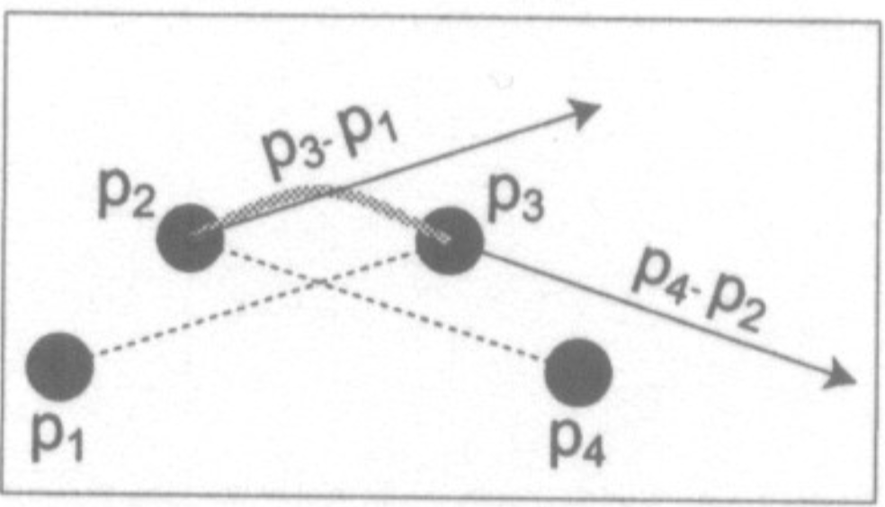

# Curves

## Natural Spline

The natural cubic/spline curve.
+ With a cubic we can produce a $C^2$ curve.
+ The position and first two derivatives at the start of a piece are the values
  at the end of the previous piece.
+ The only independent value is the position at the end of the curve.
+ This is a dependency scheme.
+ Gives the maximum degree of continuity for a cubic curve.
+ No local control
  - Making a change at the start of the curve effects the shape of the entire curve.

## Hermite Curves

+ Note: that once $\vec{u}B$ is computed, we are just multiplying control points
  by constants.
  - We have a linear combination of the control points.
+ Hermite curves specify the position and derivatives at the two end points.
+ $C^1$ continuity.
  - Ensure the position and derivative at the start of a piece is equal to the
    position and derivative at the end of the next piece.
  - These two derivatives cannot be manipulated _independantly_.
+ Gives local control.

## Cardinal Spline

+ $C^1$ continuity
+ The curve is drawn across the _second_ to _second last_ control points.
  - Can add two extra points at the two ends of the curves to "fix" this.
+ The curve travels _through_ each control point.
+ The derivative at control point $i$ is given by the vector from the $i - 1$
  to $i + 1$ control points.
+ Have a parameter called tension $t$.
  - Controls how tight the curve is between control points.
  - Between 0 and 1.
  - Scales the derivatives.

## Bezier Curve

+ Most common in computer graphics.
+ Very good Local Control.
+ Manipulating control points has _intuitive_ effect on curve.
  - Easy to design with Bezier curves.
+ $C^0$ continuity.
  - With constraints, can get $C^1$.
+ The derivative at $u=0$ is 3 times the vector from the first to the second
  control point.
+ The derivative at $u=1$ is 3 times the vector from the third to the fourth
  control point.
+ Thus the last two control points move the curve, while the middle two change
  the shape.
+ The blending functions are called the "Bernstein" basis.
+ Generalizable to $n^{th}$ degree.
  - We'll stick to cubic.
+ Bound by the **convex hull** of their control points.
  - Smallest polygon that contains the control points.
+ **Variation Diminishing Property** - Any line intersects the curve no more
  times than it intersects the lines connecting the control points (in order).
+ **Affine Invariant**:
  - Can translate, rotate, scale, and skew the control points and the curve
    will be transformed the same way.
+ **Symmetric** - Can reverse the order of the control points and still get the
  same curve.
+ Efficient algorithms for them exist.
+ A shared control point scheme is usually used for connecting multiple bezier curves.

## B-Spline

+ "B-Spline" refers to the basis functions.
+ Has the form $f(t) = \sum^n_{i=0} p_i b_i(t)$
  - $b_i(t)$ are the blending functions or B-spline.
    * Polynomials of degree $d$.
+ No relationship between $d$ and the number of control points $n$.
+ B-spline have a parameter $k$ which is one greater than the degree of the
  blending functions.
+ $C^{k-2}$ continuity.
+ Made of polynomials of degree $k - 1$.
+ Local control.
+ Any point on the curve depends on the nearby $k$ control points.
+ Bounded by a convex hull of its control points.
+ Exhibits the variation diminishing property.
+ The blending functions have the following properties:
  - Each one has/affects $k + 1$ knots.
  - Each one is zero before its first knot.
  - Each one is zero after its last knot.
  - Local control since each control point is multiplied by one blending function.
  - The set of blending functions sum to 1 for all parameter values between knots
    $k$ and $n + 1$.
+ The whole curve has $n + k$ knots.
+ These are **uniform** B-splines since their knot values are uniformly spaced.
  - Knot values used are $[1, 2, 3, ... n+k]$.
  - Doesn't need to be the case, just needs to be an increasing sequence.
  - Controlling the knot values allows controlling the influence that a control
    point has on the curve.
  - i.e. Control the range of its influenc.
+ Blending functions can be computed from knot values using the Cox-de Boor recurrence.
+ With duplicated knots, the curve is pulled to that knot value.
  - Each repition decreases the continuity by 1.
  - If a knot is repeated $k - 1$ times, we end up with $C^1$ continuity.
  - If a knot is repeated more than $k$ times, there will be gaps in the curve.
  - The curve can be forced to interpolate its two end points by repeating the
    knot values at those points.

## NURBS

+ Non-uniform rational B-Spline curves.
+ B-Splines can't represent conic sections.
  - Requires ratio of two polynomials.
+ Can represent some other shapes B-Splines can't.
+ Associates a scalar weight $h_i$ with each control point.
  $$
  f(u) = \frac{\sum^n_{i=1} h_i p_i b_{i,k,v}(u)}{\sum^n_{i=1} h_i b_{i,k,v}(u)}
  $$

# Curve Display

+ Can't just sample the curve at uniformly spaced parameter values.
  - The number of line segments needed for a smooth render depends on the curvature.
    * Curvature may not be uniform along the curve. (some parts may curve harder.)
  - Uniformly spaced parameter values don't produce uniformly spaced points.
+ A flat curve could be approximated with a line.
  - So we would like to find flat enough segments of a curve.
+ Construct a recursive algorithm:
  - If the curve is flat enough, draw a line between the first and last control point.
  - Otherwise, divide the curve in half (in parameter space) and recurse.
+ Curve subdivision is easy with Bezier Curves:
  - Called the de Casteljau construction.
  - With original control points $P_1$, $P_2$, $P_3$, and $P_4$...
  - The new control points for the left subdivision are $L_1$, $L_2$, $L_3$, and $L_4$ and
  - The new control points for the right subdivision are $R_1$, $R_2$, $R_3$, and $R_4$.
  - To calculate the new points for the left side:
    * $H$ is the mid point of $P_2$ and $P_3$.
    * $L_2$ is the mid point of $P_1$ and $P_2$.
    * $L_3$ is the mid point of $L_2$ and $H$.
    * Do similar for the right side but in reverse (see image.)
    * $L_4 = R_1$ which is the midpoint of $L_3$ and $R_2$
  - The calculation can be done with 2 diagonal matricies, one for the left,
    one for the right.

+ Testing for flat Bezier curves is also easy:
  - If the 2 middle control points $P_2$ and $P_3$ are sufficiently close to
    the straight line that connects the first and last control point, the curve
    is considered flat.
+ Any curve can be displayed like this.
  - First perform a basis conversion to get the equivalent bezier control points.
+ Extends to surfaces.
  - We deal with quadrilaterals and not lines in this case.

