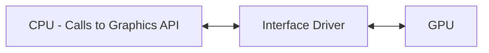

# OpenGL Topics

## Immediate Mode

+ Drawing commands are sent to the GPU as they are generated.
+ Easier to learn.
+ Easier to program for small applications.
+ Don't need to create arrays of vertices and indices and send them to the GPU.
+ But data (verts, etc.) must be sent every time.
  - Need lots of memory bus bandwidth.
  - Can become an application bottleneck.

## Retained Mode

+ Drawing commands are saved in a data structure.
+ To redraw an object, just reference the saved structure.
+ OpenGL had display lists:
  - Sequences of API calls which are saved.
  - Call the display list instead of issuing API draw calls.
  - Display lists could call other display lists.
  - Disappeared with OpenGL 3.2.
+ Retained mode makes it easier to organize and manage data.
+ Data can be stored on the GPU.
  - Thus, only need to send a little data from the CPU to draw a scene multiple times.

## Architecture

+ The OpenGL driver has grown large and complex.
+ Hard to get maximum performance from it.
+ Makes many decisions on behalf of the programmer.
+ Vulkan has a smaller driver, but the programmer has to do more work.

## OpenGL State

+ OpenGL maintains a large number of state variables.
+ Set as a side-effect of many OpenGL calls.
+ Set of `get*` procedures to retrieve state.
+ `glGetString`
  - Input: One of `GL_VERSION`, `GL_VENDER`, `GL_RENDERER`.
  - Get OpenGL version, GPU manufacturer, the renderer being used.
+ `glGetIntegerv` with `GL_NUM_EXTENSIONS` gets the number of known extensions.
+ `glGetStringi` with `GL_EXTENSIONS` and an index returns the name of an extension.
+ GLEW handles GL extensions for us.
  - Defines and sets a `GLEW_<extension-name>` define.
    * Set to true if available.
  - `glewIsSupported` takes a string of extension names.
    * Returns true if all are supported.

+ OpenGL maintains a large number of resources:
  - Vertex.
  - Textures.
  - Shader Programs.
  - Frame Buffers.
  - etc.
+ They are identified by integer ids.
+ We cannot directly reference them.
+ Allows the driver to store them in the most efficient place.
+ `glGenBuffers` to create a new buffer reference (integer id).
+ `glBindBuffer` to identify the buffer's type and create it.
+ `glBufferData` Specify size of data, the data to use, and a hint on how the
   data will be used and where it can be stored.
  - The hint param (e.g. GL_STATIC_DRAW) is made up of 2 parts.
  - The first part:
    * `STATIC`: Written once used many times.
    * `DYNAMIC`: Written more than once, used many times.
    * `STREAM`: Written many times, used only a few times.
  - The second part:
    * `DRAW`: The data is written by the CPU and READ by the GPU.
    * `READ`: The data is written by the GPU and READ by the CPU.
    * `COPY`: The data is written by the GPU, sent to the CPU, and sent back to the GPU.
  - `COPY` is used when a shader modifies or generates geometry which is fed
    through the pipeline again.
  - Problems: The driver can ignore this parameter.
    * Missed opportunity for optimization.
    * Can only specify the parameter once.
      + May want to start with Dynamic or Stream and convert to Static.
      + Would have to reload the buffer data.
    * The driver makes all the decisions on behalf of the programmer.
      + Main difference between OpenGL and Vulkan.
+ `glBufferStorage` Gives more control over how the buffer can be used.
+ `glNamedBufferStorage` "named" (by integer id) version of `glBufferStorage`.
+ `glBufferSubData` Modify the contents of a portion of a buffer.
+ `glGetBufferParameter` Get state of the buffer.

## Shaders

+ Originally, OpenGL used a fixed function pipeline.
  - Had Transformations.
  - Viewing and Projections.
  - Phong light model.
  - Texture mapping (few textures, one).
+ OpenGL3.2: Much less is fixed.
  - Have to write shaders.
+ Shaders handle one part of the pipeline.
+ Need at least 2 shaders.
  - Vertex.
  - Fragment.
+ `glCreateShader`: create a new shader object.
  - GL_VERTEX_SHADER.
  - GL_TESS_CONTROL_SHADER.
  - GL_TESS_EVALUATION_SHADER.
  - GL_GEOMETRY_SHADER.
  - GL_FRAGMENT_SHADER.
  - GL_COMPUTE_SHADER.
+ `glShaderSource`: provide shader source to the driver and associate it with a
  shader object.
+ `glCompileShader`: Compile a shader object.
+ `glGetShaderiv`: Get shader sate variables.
  - e.g. `GL_COMPILE_STATES`: Was compilation successful?
  - `GL_INFO_LOG_LENGTH`: Length of info log string
+ `glGetShaderInfoLog`: Retrieve info log string in case of, e.g., an error.
+ `glCreateProgram`: Create a new program object.
+ `glAttachShader`: Associate a shader object with a program.
+ `glLinkProgram`: Link all the shaders together to form a pipeline.
+ `glGetProgramiv`: Get program object state.
  - With `GL_LINK_STATUS`: Determine if linking was successfull.
  - `GL_INFO_LOG_LENGTH`: Info log string length.
+ `glGetProgramInfoLog`: Get info log string.
+ `glUseProgram`: Activate a pipeline (program object) to use its shaders.
+ `glUseProgramStages`: Allows using stages out of individual program objects.
  - Can use one copy of shader objects across multiple programs.
    * Save memory.
+ `glGetProgramBinary`: Retrieve linked program binary format.
  - Can save it to disk to not have to recompile shaders.
+ `glProgramBinary`: Installs existing binary for a program into a program object.

+ New assembler languages for shaders have been introduced (or already existed).
  - SPIR-V: mainly for Vulkan and OpenCL, can be used with OpenGL.
  - PTX: Mainly for CUDA.
  - Allows developing own shader language.

## Framebuffer Objects

+ Can render to off screen memory.
+ Then use the result in another render pass.
+ Most common use is to generate a texture that is later applide to objects.
  - e.g. Cube maps for environment mapping.
    * Generate each texture for the cube map.
    * Then apply to the corresponding object.
+ `glGenFramebuffers`: Generate framebuffer names.
+ `glBindFramebuffer`: Bind the created framebuffer object to a target (e.g. GL_FRAMEBUFFER).
  - Requires allocating memory for the framebuffer.
  - Generate a texture, then attach it to the framebuffer object.
+ `glFrameBufferTexture`: Attach a texture to a framebuffer object.
  - Can specify an Attachment parameter:
    * How the texture is used.
    * GL_DEPTH_ATTACHMENT - depth buffer.
    * GL_STENCIL_ATTACHMENT - stencil buffer.
    * GL_COLOR_ATTACHMENT0 - colour buffer.
  - There can be more than one color attachment.
    * They need to be selected by calling `glDrawBuffers` _before_ drawing commands.
    * A geometry shader can also select the colour buffer a drawing primitve
      will be sent to.

## Tesselation Shaders

+ Input: **Patch** - Primitive, set of $n$ vertices.
  - GL_PATCH
  - `glPatchParameteri` Set the number of vertices in a patch.
+ Generate new vertices and _triangles_ inside the primitve.
+ Used to draw other primitives or surfaces based on subdivision.

### Tesselation Control Shader

+ Compute level of tessellation.
+ Run once for each vertex of the patch.
+ Has access to all vertices of each patch.
  - Indexed by vertex number called the **InvocationID**.
+ Output 2 variables:
  - `gl_TessLevelOuter[4]`
    * Number of segments along the outer _edge_.
  - `gl_TessLevelInner[2]`
    * Number of primitives in the $u$ and $v$ direction.
      result in triangles despite
  - Default values can be set CPU side.
+ Each patch can result in different values for **adaptive resolution**.

### Tesselation Evaluation Shader

+ Called for each vertex after the tesselator unit has processed it.
+ Has access to the $u, v$ coords of the vertex over the surface of
  the patch.
+ Computes the 3D coords of the vertex.
  - `gl_Position`

### Geometry Shader

+ Called once per primitive.
+ Has access to all vertices of the primitive.
+ For each primitive, can generate several or no primitives.
+ Needs to set outputs before calling:
  - `EmitVertex()`: Generate output vertex.
  - After which they will be reset to undefined.
+ Call `EmitPrimitive()`: Bundle previous verteces into a primitive.
+ If too few vertices are specified, the primitive will be culled.
+ Can run more than once per primitive via `layout(invocations = n)` statement.
  - `glInvocationID` will have a different value each time.

