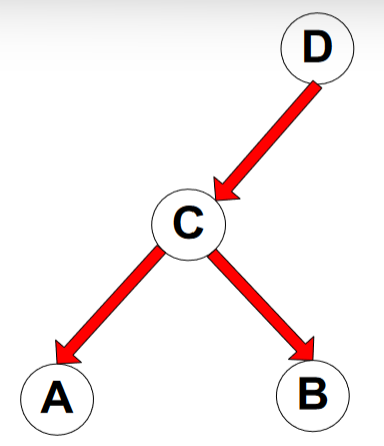

# Nearest Neighbor Classifiers

+ **Local Classifiers** - Make decisions based on local information.
+ Can produce decision boundaries of arbitrary shapes.
  - 1st nearest neighbor decision boundary is a Voronoi diagram.

General approach:
+ Compute distance to all other training records.
+ Identify the $k$ nearest neighbors.
+ Use the class labels of the nearest neighbors to determine the class of an
  unknown record.
  * Majority vote.
  * Majority vote weighted by distance (weight $= \frac{1}{d^2}$).

Issues:
+ Small $k$s are sensitive to noise.
+ Large $k$s may incorrectly include points from other classes.
+ Requires a normalization preprocessing step.
  - Prevent distance measures from being dominated by one attribute.
+ It is difficult to choose an appropriate $k$.
+ Inference time can be long.
  - Could avoid having to compute distance to all objects.
  - Could sample only a subset of all objects.
+ It is difficult to choose an appropriate distance/similarity (proximity) measure.

Choice of distance:
+ Euclidean distance.
+ Cosine distance (for documents.)

How to handle missing values in training and test sets:
+ Proximity computations normally require the presence of all attributes.
  - Could use a subset.
    * Likely to produce bad results.
    * Effectively uses different proximity measures for instances.
  - Drop the entity with missing data.

Handling _irrelevant_ and _redundant_ attributes:
+ Irrelevant attributes add noise.
  - Feature selection.
+ Redundant attributes add bias.
  - Dimensionality reduction.

# Bayes Classifier

+ Probabilistic framework for solving classification problems.
+ Based on the Bayesian Theorem.
$$
P(A|B) = \frac{P(B|A)P(A)}{P(B)}
$$
+ Also, Conditional Probability.
$$
P(Y|X) = \frac{P(X \text{ and } Y)}{P(X)}
$$

## Bayes Theorem for Classification

Given a record with attributes $(x_1, x_2, ..., x_d)$:
+ Predict class $y$.
+ i.e. Find a class $y$ for the record that maximizes the probability that its
  true: $P(y|x_1, x_2, ..., x_d)$
+ Process:
  - Using Bayes Theorem:
$$
P(y|x_1, x_2, ..., x_d) = \frac{P(x_1, x_2, ..., x_d|y)P(y)}{P(x_1, x_2, ..., x_d)}
$$
  - Note how the denominator is always the same for each choice of $y$ (class).
    * We only need to look at the numerator; choose the largest one.
  - Estimate $P(x_1, x_2, ..., x_d|y)$:
    * _Assume_ independence among the $x$s:
$$
P(x_1, x_2, ..., x_d|y) = P(x_1|y)P(x_2|y)...P(x_d|y)
$$
  - The unknown point is classified $y$ if the chosen $y$ gives the largest 
    value for $P(y)\prod P(x_i|y)$.

Probabilities:
+ $P(y)$ is the fraction of instances of class $y$.
+ For _categorical_ attributes:
  - We are concerned with the probability given attributes with a value.
  - $P(x_i=c|y) = \frac{n_c}{n}$
    * i.e. The number of instances where $x_1 = c$ and belong to class $y$.
+ For _continuous_ attributes:
  - Could **discretize** the attribute.
    * Changes from continuous to ordinal.
  - Perform a **Probability Density Estimation**.
    * Assume attribute follows a normal distribution.
    * Use data to estimate mean and standard deviation.
    * Then estimate $P(x_i|y)$
    * $P(x_i|y) = \frac{1}{\sqrt{2\pi \sigma^2}}e^{-\frac{(x_i - \mu_i)^2}{2 \sigma^2}}$
    * Variance ($\sigma^2$) $= \frac{\sum(x_i - \mu_i)^2}{n}$

Issues:
+ If one of the conditional probabilities is 0, then the entire estimate
  (specifically, the numerator) becomes 0.
  - i.e. It will be unable to classify $x$.
  - Would need to use other estimates of conditional probabilities.
+ Alternative estimations:
  - Conditional Probability: $\frac{n_c}{n}$.
  - Laplace Estimate: $\frac{n_c + 1}{n + v}$.
    * $v$ is the total number of attribute values $x_i$ can take.
  - m-estimate: $\frac{n_c + mp}{n+m}$.
    * $p$ is the initial estimate, known **apriori**.
    * $m$ is a hyper-parameter for the confidence in $p$.
+ Redundant and correlated attributes will violate class conditional assumption.

Good points:
+ Robust to isolated noise points.
+ Robust to irrelevant attributes.

# Bayesian Belief Networks

+ Provides a _graph_ical representation of probabilistic relationships among
  variables.
+ Directed Acyclic Graph.
  - Nodes are a variable.
  - Edges are a dependence between variables.
+ Probability Table associating each node to its immediate parent.

What is the joint probability distribution of $P(A \& B \& C \& D)$?

+ Use the probability table plus the DAG to figure it out:
  - If $x_i$ does not have any parents in the DAG, the table contains the prior
    probability $P(x_i)$.
  - If $x_i$ has only one parent ($y$), the table contains the conditional
    probability $P(x_i|y)$.
  - If $x_i$ has multiple parents ($y_1, y_2, ..., y_k$), the table contains
    the probability $P(x_i|y_1, y_2, ..., y_k)$.
  - Read the probabilities off of the table and multiply them together.
  - Then take the class that produces the highest probability.
+ How do you choose the probabilities to use?
  - Look at the DAG!
  - Given the above DAG:
    * $P(C|D\&A\&B) = P(C|D)P(A|C)P(B|C)$
  - Each of those probabilities should be present in the probability table.
  - Note: If an attribute has more than 2 parents, e.g. $x$ has parents $a$, $b$:
    * $P(x|a\&b...) = ...P(x|a\&b)$.
    * The probability will still be present in the table, no need to calculate it.

