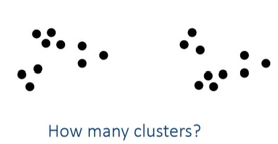

# Clustering

**Clustering/Cluster Analysis** - Finding groups of objects such that objects
within a group will be similar to each other and different from objects in
other groups.

Applications:
+ **Understanding**:
  - Group related docs, genes, stocks.
+ **Summarization**:
  - Reduce the size of large data sets.

## What Isn't Clustering?

+ Simple segmentation.
+ Grouping on results of queries.
+ Supervised Classification.
  - (Because we have the class label.)

## Clusters

+ The idea of a cluster is ambiguous.


## Types of Clusterings

+ **Partitional** Clustering:
  - Non-overlapping subsets.
  - Each data object is in exactly one subset.
+ **Hierarchical** Clustering:
  - Nested clusters organized into a hierarchical tree.
  * _Traditional_: Fully nested clusters.
  * _Non-Traditional_: A mix of hierarchical and partitional clusters.
  - Use **Dendrogram** diagrams to visualize clusters.
+ **Exclusive** Clusters:
  - Objects may belong to only one cluster.
+ **Non-Exclusive** Clusters:
  - Objects may belong to only one cluster.
+ **Fuzzy** Clustering:
  - Objects belong to _every_ cluster to some _degree_ [0, 1].
+ **Non-Fuzzy** Clustering:
  - Objects either belong to a cluster, or they don't.

## Types of _Clusters_

### Well-Separated Clusters

A set of objects such that any object is more similar to every other object in
the cluster than to any object in other clusters.

### Center Based

A set of objects such that any object is more similar to the center of its
cluster than to the center of any other cluster.
+ The center can be a **centroid**: The average of the objects in a cluster.
+ Or the center can be a **medoid**: The most "representative" point of a
  cluster.

### Contiguity Based

A set of objects such that any object is more similar to _one or more_ other
points in the cluster than to any object in other clusters.
+ Can get weird shapes.

### Density Based

**Dense** regions of objects separated by low-density regions.
+ Also can get weird shapes.
+ Used when clusters are irregular shaped or intertwined.
+ Used when noise and outliers are present.

### Conceptual Clusters

Clusters are formed from a shared physical or conceptual property.
+ Find clusters that _share some common property_ or
  _represent a particular concept_.

# Clustering Algorithms

## Simple K-Means

+ Partitional.
+ The number of clusters $k$ must be specified.
+ Centroid based clusters (center based).
```
Select $k$ points as the initial centroids.
repeat
  Form $k$ clusters by assigning all points to the closest centroid.
  Recompute the centroid of each cluster.
until The centroids don't change.
```
+ Initial centroids are chosen randomly.
  - Typically the mean of the points in the cluster.
+ K-Means _will_ converge for common similarity measures.
  - Most convergence happens in the first few iterations.
+ Complexity is $O(nkld)$
  - $n =$ number of points.
  - $k =$ number of clusters.
  - $l =$ number of iterations.
  - $d =$ number of attributes.

## Evaluating K-Means Clustering

**Sum of Squared Error**:
+ _Error_ is the distance to the nearest cluster.
+ Square these errors, then sum them
$$
\text{SSE} = \sum^K_k\sum_{x \in C_k}\text{dist}^2(m_i, x)
$$
+ Again:
  - Within a cluster, square the distances of each point to the cluster ($m_i$).
  - Then sum these squared distances.
  - Do this for each cluster and sum those results.
+ Given 2 (or more) sets of clusters, prefer the one with the smallest SSE.
+ An easy way to reduce SSE is to increase $k$.
  - Be careful! A good clustering with smaller a $k$ can have a lower SSE than a
    poor clustering with a higher $k$.

## Issues

+ Outliers.
+ Sensitive to inital cluster center choices.
+ Clusters of different sizes.
+ Clusters of different densities.
+ Clusters with non-globular shapes.
+ $\frac{k!}{k^k}$ chance of randomly choosing a centroid from each "real"
  cluster. (Clusters assumed to be the same size.)

+ Could use many clusters and later join some of them to overcome some
  weaknesses.

+ Selecting good initial centroids is difficult.
  - Could do multiple runs.
  - Could sample and use hierarchical clustering to determine initial centroids.
  - Select more than $k$ initial centroids and then select among them the most
    widely separated.
  - Use Bisecting K-Means
    * Not as susceptible to initialization issues.

## Bisecting K-Means

