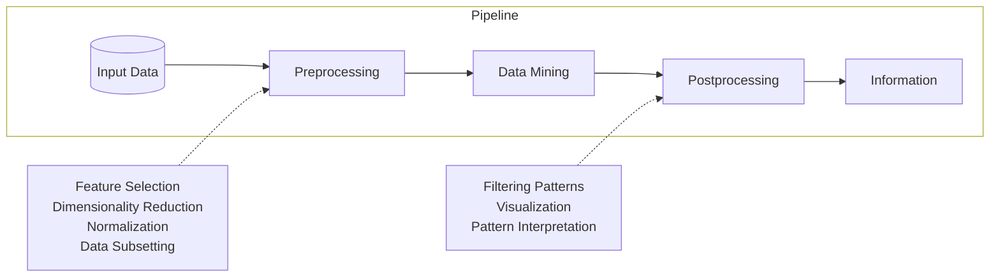

# Lecture 1

## Why Data Mining?

Large scale data is everywhere!
For example:
+ Social Networking (social network mining).
+ Traffic Patterns.
+ E-Commerce.
+ Cyber Sec. (anomoly detection).
+ Sensor Networks.
+ Computational Simulations.

Commercial Viewpoint:
+ Lots of data is being collected ^^^^
  - We need tools to organize and learn from the data.
+ Computers have become cheaper & more powerful.
  - Can be used to provide better customized services.
  - Competitive pressure.
    * e.g. How can use data for big bucks.

Scientific Viewpoint
+ Data is collected and stored at enormous speeds.
  - e.g. Remote sensors on a satellite.
  - Telescopes scanning the skies.
  - Scientific simulations.
+ Data mining helps scientists:
  1. ..in automated analysis of LARGE datasets.
  2. ..in hypothesis formation.

## What is Data Mining?

+ Many Definitions.
  1. > Non-trivial extraction of _implicit_, _previously unknown_ and potentially
     > _useful_ information from data.
     Rule of thumb: If you know the result beforehand it ain't data mining.
  2. > Exploration & analysis, by automatic or semi-automatic means, of large
     > quantities of data in order to discover _meaningful patterns_.

Pipeline

What is not Data Mining?
+ Querying a web search engine for info.
+ Looking up a phone number in the Yellow Pages.

What is Data Mining?
+ Predict who will subscribe to an online newspaper.
+ Group together similar documents returned by a search engine.
  - How do you define similar?
  - Requires **Understanding** of data.

## Why not Classical Data Analysis?

Does not cater to:
+ Scalability.
  - Techniques were developed for smaller datasets.
+ High Dimensionality.
+ Heterogeneous and Complex Data.
+ Data Ownership and Distribution.
  - We may only have partial access or data is distributed (not available from one source.)
+ Non-traditional Analysis.

~~~admonish
You can also say that if the above characteristics are not part of the analysis
problem, you are not performing Data Mining.
~~~

## Origins

Draws ideas from:
+ Machine Learning/AI, pattern recognition, statistics, and database systems.
+ Key component of the emerging field of Data Science and data-driven discovery.

## Data Mining Tasks

+ Prediciton Methods.
  - Use some variables to predict unknown or future values of other variables.
  - Classification.
  - Anomaly Detection.
  - Regression.
+ Description Methods.
  - Find human-interpretable patterns that describe the data.
  - _Understand_ the data.
  - Clustering.
  - Association Rule Mining.
  - Sequency Pattern Mining.

### Classification

+ Find a model for a _class_ attribute as a function of the values of _other
  attributes_.

Examples:
+ Classifying legitimate/fraudulent credit card transactions.
+ Classifying land covers (water bodies, urban areas) using satellite data.
+ Categorizing news stories (finance, sports).
+ Predicting tumor cells as benign or malignent.

### Regression

Predict a value of a given continuous valued variable based on the values of
other variables, assuming a linear or non-linear model of dependency.

Examples:
+ Predict sales amounts of new product based on advertising expenditure.
+ Predict wind velocities as a function of temperature, humidity, air pressure,
  etc.
+ Time series prediction of stock market prices.

### Clustering

Grouping of similar or related objects. Intra-cluster differences are
minimized, while inter-cluster differences are maximized.

Examples:
+ Understanding:
  - Custom profiling for targeted marketing.
  - Group related documents for browsing.
  - Group genes and proteins that have similar functionality.
+ Summarization:
  - Reduce the size of large datasets.

### Association Rule

Discovery:
+ You have a set of records which contain some number of items from a
  collection.
+ Produce _dependency rules_ which predict the occurrence of an item based on
  the occurrence of other items.

Analysis:  
+ Market-basket analysis:
  - Rules are used for sales promotion, shelf management, inventory management.
+ Telecommunication alarm diagnosis:
  - Used to find combination of alarms that occur together frequently in
    the same time period.
+ Medical informatics:
  - Used to find combination of patient symptoms and test results associated
    with certain diseases.

### Deviation/Anomaly/Change Detection
+ Detect _significant deviations_ from normal behaviour.
+ Credit card fraud detection.
+ Network intrusion.
+ Changes in global forest cover.

## FAQ

Why are some labs repetative?
To develop fluency and to see differences in techniques across different datasets (ex: performance.)

