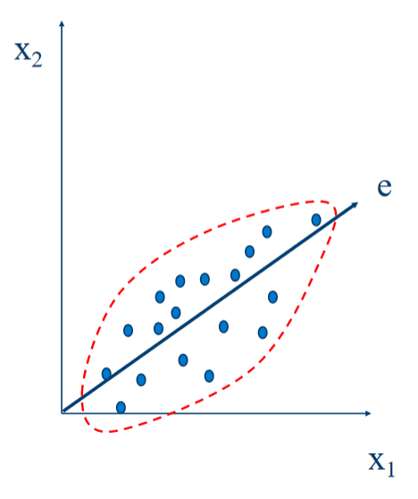

# Data
## What is Data?

+ Collection of objects and their attributes.
+ An **attribute** is a property of an object.
  - Also called a "feature" (among other names.)
+ A collection of attributes describe an **instance** (object).
+ Data may be made up of different parts.
  - eg: Name: First name + Last name.
+ Attributes/Objects may have relationships with other attributes/objects.
+ Data can have structure.
  1. Structured. Generally uses databases. Think data stored in CSV.
  2. Unstructured. Text
  3. Semi-structured. Mix of both: XML, JSON.
+ Data can be incomplete. 

## Types of Attributes

+ **Nominal** - Distinctness, Meaningless ie: just enough information to
  distinguish one object from another.
+ **Ordinal** - Ordered, Meaningfull.
+ **Interval** - Difference, Meaningfull.
  - Ex: Calendar dates (differences), temperature differences.
+ **Ratio** - Meaningfull. A ratio.
  - Ex: Temperature in Kelvin, length, counts, elapsed time (e.g., time to
    run a race)
  - Rooted in/in-respect-to/over units that have an "absolute zero".
    * e.g. Temp in Kelvin: $2 \cdot 10K$ is twice as hot as 10K, but
      $2 \cdot 10C$ is not twice as hot as 10C (technically).

The type of an attribute depends on which properties/operations it supports:
+ **Nominal**: `=` & `!=`.
+ **Ordinal**: `=`, `!=`, `<` & `>`.
+ **Interval**: `=`, `!=`, `<`, `>`, `+` & `-`.
+ **Ratio**: `=`, `!=`, `<`, `>`, `+`, `-`, `*` & `/`.

Ratio is a subset of Interval, which is a subset of Ordinal, which is a subset
of Nominal.

### The Difference Between 'Ratio' and 'Interval'

ex: Is it physically meaningfull to say $10\deg$ is twice $5\deg$ on:
+ the Celsius scale? No.
+ Kelvin? Yes.
+ Fahrenheit? No.

In some scales the ratio does not matter, the difference does. (More informative).
The way that you measure the attribute, determines the type of the attribute.
In the above example, Celsius and Fahrenheit have their zero value
"arbitrarilly" chosen, but Kelvin has its zero value at _absolute zero_.
Again, the way it is measured matters. (You'll want to stick to intuitive scales for measurements.)

## Discrete and Continuous Attributes

Discrete:
+ Finite or _Countably Infinite_ set of values.
+ Example: Zip Codes, set of words in a document, etc.
+ Often represented as integer variables.
+ Note: **Binary** attributes are a special case of discrete attributes.

Continuous:
+ $R$eal numbers as attribute values.
+ Example: Temperature, height, weight.
+ Typically represented as floating-point variables.

## Important Characteristics of Data

### Dimensionality

+ Number of attributes.
+ Brings a number of challenges.

### Sparsity

+ Only presence of the value counts.
+ Some attributes/features may have "no" entry.

### Resolution

+ Patterns can depend on scale.
+ ex: Temperature at a daily/weekly/monthly scale.

### Size

+ Amount of data.
+ Type of analysis used may depend on data size.

## Types of Data Sets

+ Record - Data that consists of a collection of records, each with a set of
  fixed attributes.
  - Transaction Data.
  - Data Matrix.
  - Document Data.
+ Ordered.
  - Spatial Data.
  - Temporal.
  - Sequential.
  - Genetic Sequence Data.
+ Graph.
  - The www.
  - Molecular Structures.

### Records

Data that consists of a collection of records, each with a fixed set of
attributes.
Note: Matrix representation is good for our Data Mining techniques.

+ Data Matrix:
  - Object has same fixed set of numeric attributes.
  - Think of objects as points in multi-dimensional space.
    * Each dimension represents a distinct attribute.
  - Represent as an $m * n$ matrix.
+ Document Data:
  - Each document is represented as a 'term/word' _vector_.
  - Represent as a matrix of documents and terms.
  - Each 'term' is a component of a document 'term' vector.
  - The value of each 'term' can be, for example, the frequency/count of the term
    within the corresponding document.
  - also called "_vector space representation_", "bag of words".
  - This representation loses some information: order of words.
  - This is a sparse representation.
  
+ Transaction Data:
  - Each transaction involves a _set_ of _items_.
  - In a visual table representation: Each row is sometimes called a transaction.

+ Ordered Data
  - Sequences of transactions.
    ```
    (a b) (d) (c e)
    (b d) (c) (e)
    ```
  - Each parenthesized group is an element of the sequence.
  - Order _within_ the parens does not matter (with our definition).
  - The individual `a`, `b`, etc. are called "items" or "events".
  - Spatio-Temporal Data:
    * e.g. Average Monthly Temperature of land and Ocean.

+ Graph Data:
  - Usefull when instances of objects are not independent and have relationships
    to other.
  - Consider: Social networks.

## Data Quality

Before doing anything: Consider data quality as a serious problem.

+ Poor quality negatively affects data processing efforts.
+ > Poor data quality costs the typical company at least 10% of revenue; 20% is probably a better estimate. Thomas C. Redman, DM Review, August 2004.

+ What are data quality problems?
+ How can we detect problems with the data?
+ What can we do about these problems?

+ What are data quality problems?
  - Noise:
    * For objects, noise is an extraneous signal.
    * For attributes, _noising_ refers to an extraneous signal modifying the
      original values.
    * Example: Distortion of a person's voice on a poor phone.
  - Outliers:
    * Objects with characteristics that are considerably different than most of
      the other data objects in the data set.
    * Case 1: Outliers are noise that interferes with data analysis.
    * Case 2: Outliers are the goal of analysis: Credit card fraud.
  - Is noise always an outlier?  
    Not necessarily, noise can be consistent causing no outliers or be regular
    objects (Case 2 above?)
  - Missing values:
    * Information may not be collected.
    * Attributes may not be applicable in all cases: (annual income for small childs.)
    * Can be handled by:
      + Eliminating objects.
      + Estimate missing values. (preffered.)
      + Ignore attributes.
  - Duplicate Data - Data sets from different sources may contain duplicates
    or near-duplicates:
    + Example: Same person with multiple email addresses.
    + Data Cleaning: Remove duplicate data.
    + Should duplicate data always be removed?  
      No, ex: duplicate purchases (from anonymous buyers?)
  - Fake Data.

## Similarity and Dissimilarity Measures

+ Similarity Measure:
  - A good building block for further analysis.
  - Numerical measure of how alike two data objects are.
  - Often in the range $[0..1]$
+ Dissimilarity Measure:
  - The opposite of Similarity :p
  - Minimum is often 0.
  - Upper limit varies.

**See table on slide 32**

### Euclidean Distance
+ $n$ is the number of dimensions.
+ Standardization is necessary if scales differ.**
+ If an attribute is on a much larger scale than other attributes, it will
  dominate the distance measure. ex: age vs sallary.
+ Standardize via: $\frac{(x - \bar{x})}{\text{std.deviation}}$
+ Distance matricies are a thing.
$$
d(x,y) = \sqrt{\sum_{k = 1}^n(x_k-y_k)^2}
$$


### Minkowski Distance

+ Generalization of Euclidean Distance.
+ $r$ is a hyper parameter, $n$ is the number of dimensions.
+ AKA. L<blah> norm. ($r$ = <blah>)
  - L1 = Manhattan.
  - L2 = Euclidean.
  - Lmax = supremum - maximum difference between any component of the vectors.
    * $r \rarr \text{infinity}$

$$
d(x, y) = (\sum_{k = 1}^{n}|x_k - y_k|^r)^{\frac{1}{r}}
$$

$ r -> infinity $: d(x,y) = $max(abs(x_1 - y_1), abs(x_2 - y_2), ...)$

### Mahalanobis Distance

$\text{Mahalanobis}(x, y) = (x - y)^T\Sigma^{-1}(x - y)$

+ x & y are two vectors.
+ $\Sigma$ is the covariance matrix. $\Sigma_{ij} = E[(X_i - E[X_i]) (X_j - E[X_j])]$
+ In a sense: the covariance matrix encodes the distribution of the entire data set.
+ Considers std deviation of data set in distance calculation.

## Similarity Between Binary Vectors

+ Commonly, objects have only binary attributes.
+ Some simple measures can be computed from the following:
  - $f_{0,1}$ = # of attr. where instance a was 0 and instance b was 1.
  - $f_{1,0}$ = # of attr. where instance a was 1 and instance b was 0.
  - $f_{0,0}$ = # of attr. where instance a was 0 and instance b was 0.
  - $f_{1,1}$ = # of attr. where instance a was 1 and instance b was 1.

### Simple Matching Coefficient (SMC)

+ Similarity between binary vectors is:
$$
 \frac{\text{Number of matches}}{\text{Number of attributes}} \\
 \frac{f_{1,1} + f_{0,0}}{f_{1,1} + f_{0,0} + f_{0,1} + f_{1,0}}
$$

### Jaccard Coefficients (J)
$$
 \frac{\text{Number of (1, 1) matches}}{\text{Number of \textit{non-zero} attributes}} \\
 \frac{f_{1,1}}{f_{1,1} + f_{0,1} + f_{1,0}}
$$

  - SMC vs J Example:  
    $
    \vec{x} = [1 0 0 0 0 0 0 0 0 0]\\
    \vec{y} = [0 0 0 0 0 0 1 0 0 1]\\
    $
    $
    \begin{matrix}
    f_{0,1} &= 2 \\
    f_{1,0} &= 1 \\
    f_{0,0} &= 7 \\
    f_{1,1} &= 0 \\
    \end{matrix} \\
    $
    $
    \begin{matrix}
    \text{SMC} &= \frac{0 + 7}{2 + 1 + 0 + 7} &= 0.7 \\
    \text{J}   &= \frac{0}{2 + 1 + 0}         &= 0 \\
    \end{matrix}
    $

## Cosine Similarity

+ Suppose $x$, $y$ are vectors.
+ $cos(x, y) = \frac{x \cdot y}{||x|| ||y||}$

## Extended Jaccard Coefficient (Tanimoto)

+ Variation of Jaccard for continuous or count attributes.
+ Reduces to Jaccard for binary attributes.
$EJ(x, y) = \frac{x \cdot y}{||x||^2 + ||y||^2 - x \cdot y}$

## Comparison of Proximity Measures

+ Different measures are used depending on the domain of application.
  - Similarity measures _tend to be specific to the type of attribute_ and data.
+ Though, there are properties that would be nice for similarity measures to have.
  - Symmetry
  - Tolerance to noise and outliers.
+ The measure should produce results that agree with domain knowledge.

# Data Preprocessing

+ Aggregation.
+ Sampling.
+ Dimensionality Reduction.
+ Feature Subset Selection.
+ Discretization and Binarization.

## Aggregation

+ Combining two or more attributes or objects.
+ For data reduction.
+ For changing scale.
  - Days aggregated into weeks, months, etc.
  - Cities into regions, states, etc.
+ For more stable data.
  - Aggregated data tends to have less variability.

## Sampling

+ Main technique for data reduction.
+ Using the entire data set is too expensive/time consuming.
+ A _representative_ sample works almost as well as using the entire data set.
  - representative sample requires approximately the same properties as the
    original data set.

### Simple Random Sampling

+ Equal probability of selecting any particular item.
+ **Sampling without replacement** - When an item is selected, remove it from
  the population.
+ **Sampling with replacement** - The item is not removed from the population
  when selected.

### Stratified Sampling

+ Split the data into several partitions.
+ Randomly sample _from each partition_.

## Curse of Dimensionality

+ As dimensionality increases, data becomes increasingly sparse.
+ Definitions of _density_ and _distance_ between points _become less
  meaningful_.

## Dimensionality Reduction

+ Avoid the curse of dimensionality.
+ Reduce the amount of time and memory required by algorithms.
+ Allows data to be more easily visualized.
+ Help eliminate irrelevant features or reduce noise.
+ Techniques:
  - Principal Components Analysis (PCA)
  - Feature Subset Selection
  - Singular Value Decomposition
  - Others...

### Principal Components Analysis (PCA)

+ Find projection that captures the largest amount of variation in data.


## Feature Subset Selection

+ Unlike dimensionality reduction, does not change the value of features.
+ Avoid duplicate features.
+ Avoid irrelevant features.

## Discretization

+ Convert a continuous attribute into an ordinal.
  - Maps potentially infinite values to small number of categories.
+ Many classification algorithms work best if variables have only a few values.

