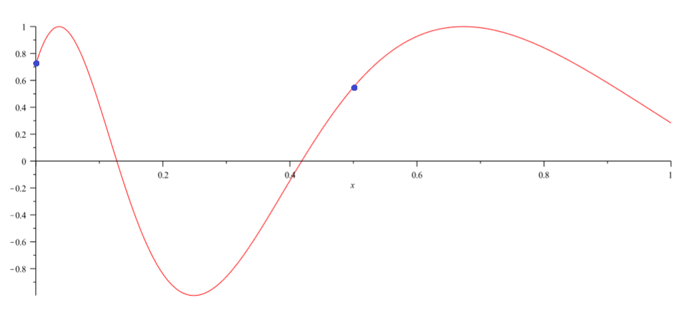

# Root Finding and Iterative Methods

+ Many problems in scientific computing can be posed as a root finding problem.
+ Many problems may result in nonlinear equations without exact solutions.
+ We can find an _approximate_ solution instead.
  - With a _bound on_ or _estimate of_ the error.
+ Two iterative methods for finding approximate solutions are studied:
  1. Bisection.
  2. Newton's method.
+ The main idea behind iterative methods is:
  1. Start with an initial approximation of the desired value.
  2. Apply some transformation to the original approximation to generate a new,
     more accurate approximation.
  3. Determine if the new approximation is within desired _error_ and
     _residual_ thresholds.
     - If it is, we found the (approximate) solution to the problem. Iteration
       stops.
     - If not, continue from step 2 using the new approximation as the input to
       the transformation.
  4. Otherwise stop if a maximum number of iteration thresholds has been
     reached.
+ We may want to check both error and residual as stopping conditions.
  - There may be cases where the error may be within an acceptable threshold
    but the residual may not.
+ There are three essential questions:
  - Under what conditions does an iterative algorithm converge?
  - How accurate will the result be?
  - How fast does it converge?

## Terminology and Notation

+ $x^*$ - The goal value (e.g. The value of $x$ for which $f(x) = 0$).
+ $x^{(k)}$ - The $k^{\text{th}}$ _approximation_ of $x^*$.
+ $x^{(0)}$ - The initial guess of $x^*$.
+ **Iterates** - Approximations of $x^*$.
+ $\phi$ - A function generating successive iterates.
  - Essentially approximates $x^*$.
  - e.g. $x^{(k + 1)} = \phi (x^{(k)})$
  - Note: The above equation is a recurrence relation.
+ **Error** - Difference between the approximation of $x^*$ and $x^*$ itself.
+ **Residual** - Difference between the root $f(x^*) = 0$ and the value of the
  function at the approximation $f(x^{(k)})$. Or, more simply, just
  $f(x^{(k)})$.

## Convergence of iterations.

+ Ideally, the sequence created from repeated evaluations of $\phi$ converges
  towards $x^*$.
+ This may not be the case in the two iterative methods we look at.

## Bisection

+ You know that the root of the function exists within the range $[a, b]$.
+ The goal is to "home in" on the root by halving the search space ($[a, b]$)
  each iteration.
+ The size of the remaining domain when done is the size of the error:
  - Error $= |x^{(k)} - x^*| <= \frac{1}{2^k}$
+ The residual is simply $f(x^{(k)})$.
+ Converges if $x^*$ is a _unique_ solution to $f(x) = 0$ within $[a, b]$ and
  $f$ is continuous.
  - In the image below, evaluating the function at the 2 blue dots would remove
    both roots from the search space on the next iteration.

+ $x^*$ can be calculated up to machine precision.
+ Speed of convergence: The error $|x^* - x^{(k)}|$ decreases by a factor of
  $\frac{1}{2}$ each iteration.

## TODO: Newton's Method

I don't remember what this means: residual $~= |y'|error$

