# Automata

An **Automaton** is defined by five things:
+ $Q$ - A finite set of states.
+ $\Sigma$ - The alphabet of the input.
+ $\Delta$ - A transition function mapping a set of old states to a set of new
  states given the next symbol in the input.
+ $q_0$ - The initial state.
+ $Q_f$ - A set of final states.

+ A **Deterministic Finite Automaton** is deterministic in that the $\Delta$
  function returns a _one or zero_ states for each transition.
  - It also returns exactly zero states for any $\epsilon$-transition.
+ A **Non-Deterministic Finite Automaton** has a transition function that can
  return _two or more_ states for each transition.
+ All DFA are NFA, but not the other way around.
+ A string is **accepted** by an Automaton if a final state can be reached by
  the string from the initial state.

Transitions can be visualized with a transition diagram similar to the one
below. It has:
+ States.
+ Transitions as arrows.
+ Text attached to arrows represent transition labels.
  - Labels are tokens in the alphabet or the special token $\epsilon$.
  - Note: $\epsilon \notin \Sigma$.
+ Start and Final states.
+ At most $2^Q$ target states. e.g. The powerset of $Q$.

```mermaid
---
title: An Example Automaton
---
stateDiagram-v2
direction LR

classDef finalstate ;fill:yellow;stroke-width:2px;stroke-dasharray:5px,2px;

[*] --> q0
q0 --> q1: a
q1 --> q3: b
q0 --> q2: ϵ
q2 --> q1: c
q2 --> q3: c

class q3 finalstate
```

## $\epsilon$-Closure of States

Given $A \sube Q$, the $\epsilon\text{-closure}(A)$ is a set of the states in
$Q$ that can be reached by zero or more $\epsilon$-transitions starting at
each state in $A$.

## Extending Transitions Over $\epsilon$

+ States reachable from a source state via a symbol $x$ and zero or more
  $\epsilon$-transitions:
  $$
  \Delta^\epsilon = \epsilon\text{-closure}(\Delta(\epsilon\text{-closure}({q}), x))
  $$

## Extending Transitions Over Strings

+ States reachable from $q$ via a string $s \in \Sigma^*$:
  $$
  \Delta^*(q, \epsilon) = \epsilon\text{-closure}({q}) \\
  \Delta^*(q, x_1x_2...x_L) = \Delta^\epsilon(\Delta^*(x_1x_2...x_{L-1}), x_L)
  $$

## Languages

+ A language is a subset of $\Sigma^*$.
+ The language of a finite automaton is the set of all strings in $\Sigma^*$
  that are accepted by the automaton.
+ By definition: $\mathbf{DFA} \sube \mathbf{NFA}$.
  - Thus: $\mathcal{L}_{\mathbf{DFA}} \sube \mathcal{L}_{\mathbf{NFA}}$
+ By a given theorem: $\mathcal{L}_{\mathbf{NFA}} \sube \mathcal{L}_{\mathbf{DFA}}$.
  - Thus: $\mathcal{L}_{\mathbf{NFA}} = \mathcal{L}_{\mathbf{DFA}}$
+ _Given an NFA, we can construct a DFA_.

## Powerset Construction of a DFA From an NFA

Given an NFA defined by $(Q, \Delta, \Sigma, q_0, Q_f)$, we can construct an
equivalent DFA $(\hat{Q}, \delta, \Sigma, \hat{q}_0, \hat{Q}_f)$:
+ $\hat{Q} = 2^Q$ - Each DFA state is a subset of the NFA states.
+ $\hat{q}_0 = \epsilon\text{-closure}({q_0})$.
+ $\hat{Q}_f$ = Each set $\hat{q} \in \hat{Q}$ where $\hat{q} \cap Q_f \ne \emptyset$.
+ $\delta : \hat{Q} \times \Sigma \rarr \hat{Q}$ is defined as:
  $(\hat{q}, x) = \Delta^*(\hat{q}, x)$ and described as a table.
+ The powerset construction removes epsilon transitions when applied to an NFA.
+ TODO: Example.

