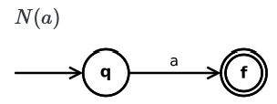
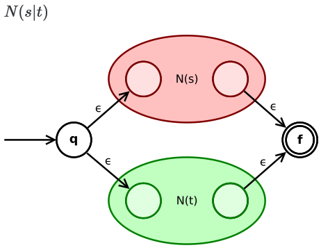
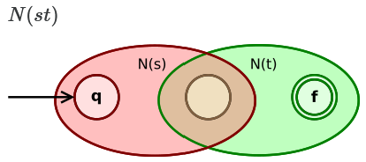
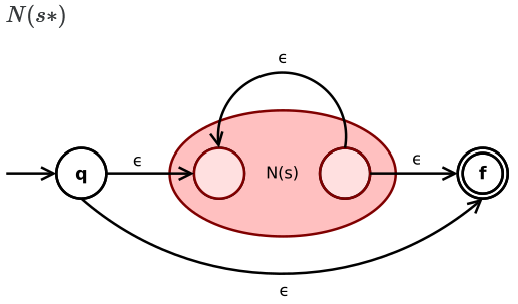

# Regular Expressions

+ **Direct Match** - Given a symbol $a$: $a$ matches the string "a"
+ **Concatenation** - e.g. Given two symbols $a$ and $b$: $ab$
+ **Alternation** - Given two symbols $a$ and $b$: $a|b$
+ **Optional** - Given a symbol $a$: $a?$ matches both: "a" and ""
+ **Repetition** - Given a symbol $a$: $a*$ matches "", "a", "aa", etc.

**Regular Language** - A language is regular if there exists some regular
expression which describes it. All regular languages are denoted
$\mathcal{L}(RE)$.

The three languages we have defined are all equivalent:
$$
  \mathcal{L}(NFA) = \mathcal{L}(DFA) = \mathcal{L}(RE)
$$

## Thompson's Construction

+ Used to convert a regex into an NFA with the equivalent language.






## Limitations

Consider a language $L_n$ of $n$ $0$s followed by $n$ $1$s:
+ ""
+ "01"
+ "000111"
+ etc.

For any specific $n$, $L_n$ is regular.
+ As $n$ grows, the NFA for $L_n$ requires more states.
+ $L_\infin$ requires infinite states.
+ $L_\infin$ is not regular ($L_\infin \notin \mathcal{L}(NFA)$).

```admonish danger
Programming languages are not regular.
```

