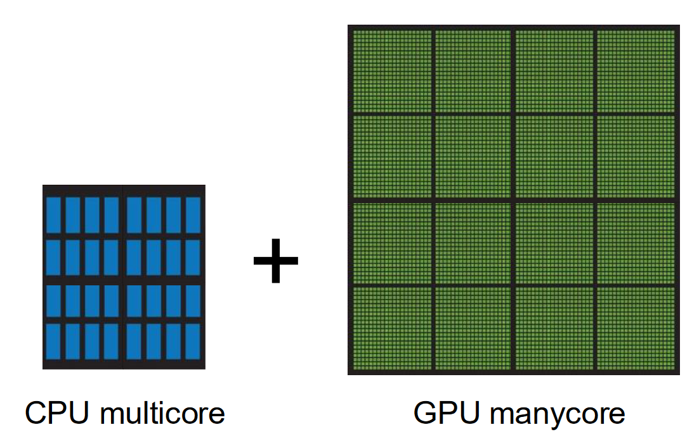

# Introduction

What is Concurrency?  
+ Two or more execution flows (e.g. threads) run _simultaneously_.

Introduction of multiple cores within a CPU came alongside a plateau in clock
speed improvements.
+ Single-threaded software no longer enjoys significant (free!) performance
  improvements with upgrades of the CPU.
+ Re-architecting of single-threaded software is required to take advantage of
  the multiple cores available on a modern CPU.

## Why is Concurrency Difficult?

+ Many different, possibly unexpected, executions of the program.
  - Makes debugging and reproducability difficult.
  - **Interleavings** - Scheduled _order_ of concurrent tasks.
+ Sharing of data and resources between threads is error-prone.

## What is Massively Parallel?

> A large number of computer processors.

The difference between **multicore** and **manycore**?
+ A difference in magnitude.
+ **Multicore** refers to having _multiple_ computational cores while
  **manycore** refers to having _many more_ multiple computational cores.

---

# Readings

## What's the Difference Between a CPU and a GPU?

|CPU|GPU|
|---|---|
|Several cores|Many cores|
|Low latency|High throughput|
|Good for serial processing|Good for parallel processing|
|Can do a handful of operations at once|Can do thousands of operations at once|

+ CPUs tend to have few cores with lots of cache memory that can handle a few
  threads simultaneously.
+ GPUs tend to have hundreds of cores that can handle thousands of threads to
  achieve **parallel computing**.
  - GPUS do this by allowing you to divide tasks among their many processors.

## [What Makes Parallel Programming Hard?](https://web.archive.org/web/20170122105042/http://www.futurechips.org/tips-for-power-coders/parallel-programming.html)

### Finding Parallelism in Tasks is Hard

+ Some tasks are easy to to parallelize.
  - Sub-tasks are independent.
  - Low data dependency.
  - ex: Two dudes can paint a wall 2x as fast by painting different halves.
+ Some tasks are hard/impossible to parallelize.
  - Sub-tasks are interdependent.
  - ex: Cooking (recipe steps often depend on previous steps being completed.)
+ Many programs have _artificial_ inter-task dependencies because programmers
  wrote them with a single-threaded mind set.
+ It can be difficult to re-write a program to be multi-thread capable.

### Debugging is Difficult

+ Different interleavings of tasks, particularly in combination with shared
  mutable data, can cause non-deterministic bugs (scheduling of tasks is
  non-deterministic.)
  - ex: Two threads read a number from shared memory, increment its value by 1,
    and write the new value back to memory. The intent is to have the original
    value incremented by 2. The following interleaving will produce incorrect
    results:
    1. Thread 1 reads the value from memory and saves it in a local variable.
    2. Thread 1 increments the local var.
    3. Thread 2 reads the value from memory and saves it locally.
    4. Thread 2 increments the local var.
    5. Thread 1 writes its local value to memory.
    6. Thread 2 writes its local value to memory.

### Optimizing for Performance is Difficult

Often, the first working version of a parallel version is slower than the
serial version.
+ Too many (task) dependencies still exist.
  - Possible due to iterative removal of these dependencies.
+ Contention for hardware resources.

~~~clojure
(require '[clojure.core.reducers :as r])
;; Data should be in format: [[a1 b1] [a2 b2] ...]
;; i.e. pairs of numbers, one from each vector.
(defn dot-parallel [vs]
  (->> vs
    (r/map (fn [[a b]] (* a b)))
    (r/fold +)))

(defn dot-sequential [vs]
  (transduce
    (map (fn [[a b]] (* a b)))
    +
    vs))
~~~

## The Free Lunch Is Over...

TL;DR

## Apple M1 & M3

A bunch of Apple marketing.

