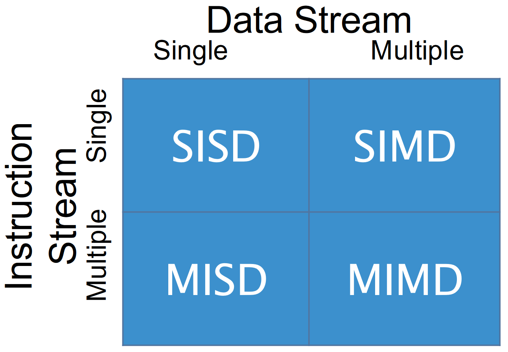

# Multicore Hardware

Goal: Increase performance.

**Speedup** $ = \frac{t_s (\text{Execution time on a single processor})}{t_p (\text{Execution time with} p \text{processors})}$

+ **Linear Speedup** - A speedup factor of $p$ with $p$ processors.
+ **SuperLinear Speedup** - Is a factor greater than $p$ possible?
  - The parallel parts of the program can be executed faster than $t_s$.
  - The parallelization presents opportunities for optimizations.
    * ex: Caching opportunities.
  - Multicore system processors may have more memory than single processor
    systems.
  - Hardware accelerators may be used in multiprocessor systems no available in
    single processor systems.
  - Nondeterministic algorithms. e.g. a solution can be found quickly in one
    part of parallel implementations.

## Parallel Architectures

Grouped by Instruction stream and Data stream.

+ **SISD** - Single Instruction Single Data.
  - Instruction level parallelism.
  - Single CPU.
+ **SIMD** - Single Instruction Multiple Data.
  - **Data Level Parallelism** - Apply a single instruction to multiple
    instances of data at the same time.
  - Many core processors.
+ **MISD** - Multiple Instruction Single Data.
  - Each processor performs different instructions on the same data.
  - Uncommon as an architecture, can be simulated by MIMD.
+ **MIMD** - Multiple Instruction Multiple Data.
  - **Thread Level Parallelism** - Each processor has its own set of
    instructions and possibly data.

### SIMD vs. MIMD

SIMD:
+ Exploit Data level parallelism.

MIMD:
+ Exploit Thread level parallelism.
+ Relatively low cost to build due to the use of the same processors as those
  found in single processor machines.
+ More flexible than SIMD.
  - Can simulate other architectures.
+ Two main sub-categories of MIMD:
  - **Centralized Shared-Memory**.
    * $< 100$ processors.
    * Memory can become a bottleneck, limiting core count.
  - **Distributed-Memory**.
    * $> 100$ processors.
    * Communication becomes difficult (e.g. syncing, stale data).

### Centralized Shared-Memory Architectures

+ Multiple processors on the same die.
+ All processors share memory and I/O devices.

+ **Symmetric Multiprocessor (SMP)**
  - Shared address space.
  - "Equal-time" access for each processor.
  - OS treats every processor the same way.
+ **Non Uniform Address Space Multiprocessor (NUMA)**
  - Different memory regions have differnt access costs.
    * E.g. "Near" vs "Far" memory.

### Distributed-Memory Architectures

+ Two important aspects:
  1. Processors - Often not located on the same chip.
     - ex: Clusters.
  2. Interconnect Network.
     - High speed interconnection network for communication across processors.
     - Even across long distances (e.g. typically fibre-optics).
+ Can have a shared memory address space or multiple address spaces.
  - If using shared memory address spaces: communication can be done via _load_
    and _store_ instructions.
  - If using multiple address spaces: communication is done via
    **message-passing**.
    * **MPI** - See the message passing library for C.
+ Using shared data can have speed consequences if loading/storing across the
  interconnect network.
  - But the data is kept up-to-date for other processors.
+ Using message passing, work on local data, send results, potential sync issues.

### Taking Advantage of MIMD

+ Run multiple processes at the same time.
+ A single process with multiple threads.

### Instruction-Level vs. Thread-Level Parallelism

+ Hardware improvements can have an affect on how we develop software.
+ Instruction level parallelism is typically independent of whether software is
  sequential or concurrent.
+ Thread level parallelism (like multicore programming) usually is dependent on
  the software being concurrent.
+ **Instruction Level Parallelism** - The many instructions contained in each
  thread. (Low Level, internal to CPU.)
+ **Thread Level Parallelism** - Multiple threads per program. (High Level.)
+ **Multithreading** - An _instruction_-level approach to multi-threaded
  programs.
  - Run multiple threads _simultaneously_.
  - Can be used on a single processor system.
  - Switch between threads using:
    * **Fine-Grained Multithreading** - Potentially between every instruction.
    * **Coarse-Grained Multithreading** - During an expensive stall.
  - Each thread has its own program counter and memory (among other things.)
  - Intel **Hyperthreading** is one approach using _Simultaneous
    Multithreading_ (SMT).

### Symmetric Multicore Design and Asymmetric Multicore Design

+ Historically, we started with multiple physically separate CPUs in one
  system.
+ Then multiple cores on the same chip with an _internal_ bus connecting the
  various cores.
+ To, most recently, **mixed-core processors** or an **Asymmetric Multicore
  Design**, Different _types_ of cores on the same chip.

### Massively Parallel Systems

+ **GPU Computing** (GPGPU)
  - 100s or more GPUs.
+ **Massively Parallel Processor Arrays (MPPAs)**
  - Array of 100s of CPUs + RAM.
+ **Grid Computing**
  - Nodes performing different tasks.
+ **Cluster Computing**
  - Nodes performing the same task.

---

# Why might not parallel instead of concurrent

+ not enough hardware (cores)
+ inter-task dependencies
+ job scheduling

# Time Slicing

Often used to refer to a particular scheduling.
allows running more threads on fewer cores if needed.

ex: 3 tasks, 2 CPUs
+ A task might be split up into multiple "time slices".
  - Each time slice will be assigned to a CPU.
  - Each task may be assigned to different CPUs at different times.
+ Maximizes hardware use (maximum parallelism) even if the tasks themselves are
  not fully parallel.

Choice of when CPUs swap tasks.
+ "Context Switches" <=> "Interleaving Points"
+ When the task awaits some result/resource (possibly shared).

# Making Parallel Programs

1. Start with a sequential program.
1. Divide the program into tasks.
   + Identify shared/local data.
1. Organize tasks into threads.
   + Consider shared/local data.
1. Write parallel versions of code using strategies from previous steps.

# Explicit vs Implicit

**implicit** - Do _not_ explicitly write parallel code. e.g. Use of
annotations, such as compiler directives, to generate a parallel version of
your code.
**explicit** - Explicit use of threads and organizing code into parallelizable
chunks.

