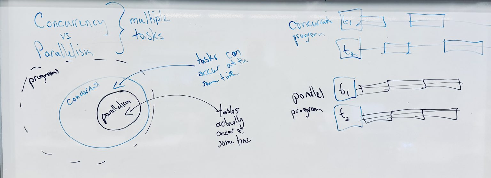

# Concurrency, Parallelism, and Scheduling

Consider a program to be made up of individual, possibly interdependent, tasks.

+ **Concurrency** - These tasks are capable of being executed at the same time.
+ **Parallelism** - These tasks **are** executed at the same time.

In this sense, parallel programs are a subset of concurrent programs. Where
concurrent programs are capable of, but may decide against, executing their
tasks at the same time, parallel programs certainly do.

+ A concurrent program that does not run its tasks at the same time may still
  progress in each task simultaneously.
  - For example, by interrupting progress in one task to work on another.

+ **Time Slicing** - The way tasks are cut up and scheduled on the CPU.
  - Generally, the goal is to keep the CPU busy with tasks.

## Making a Program Parallel

1. Start with a sequential algorithm.
2. Divide the program into tasks.
3. Organize tasks into threads.
4. Write parallel versions of code guided by steps 2 and 3.

