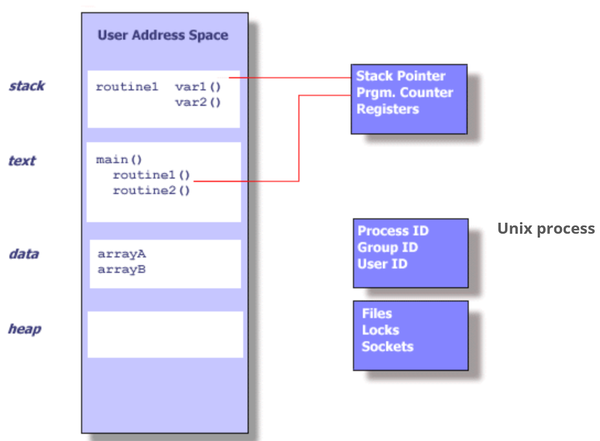
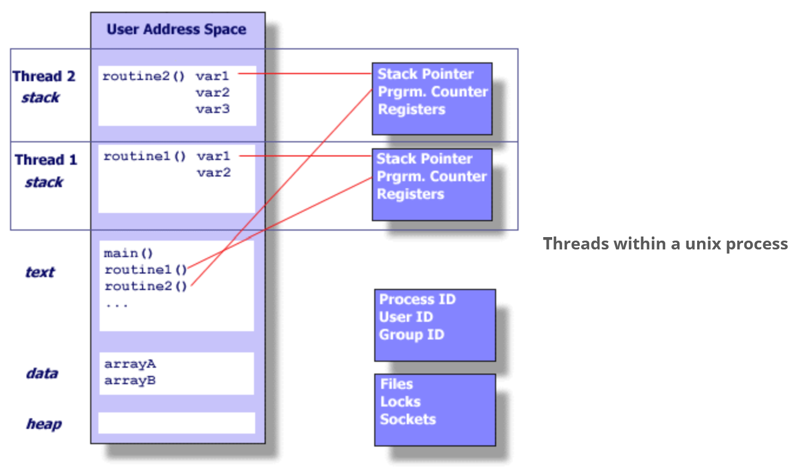

# Posix Threads

+ Processes contain information about program resources and program execution
  state:
  - Process ID & User ID.
  - Environment Variables.
  - Working Directory.
  - Program Instructions.
  - CPU state (registers, fault info).
  - Memory allocation (stack and heap).
  - File Descriptors.
  - Signal Actions.
  - Shared Libraries.
  - Inter-Process Comm. related info (message queues, pipes, semaphores,
    shared mem.)

+ Threads contain a minimum of information:
  - Stack Pointer.
  - Registers.
  - Scheduling Properties ("Policy" or priority).
  - Thread-Specific data.

A thread:
+ Exists within a process.
+ Uses the process' resources
+ Has its own independent control flow
+ Duplicates only the essential resources it needs to be independently
  schedulable.
+ May share the process resources with other threads.

Since threads within the same process share resources:
+ Changes made to shared system resources will be seen by all threads.
+ Two pointers with the same value point to the same data.
+ Reading/Writing to the same memory locations is possible, requires explicit
  synchronization by the programmer.

## Thread Scheduling
+ Non deterministic in thread order.
+ Can't guarantee same program execution.
+ Most non-determinism is _not_ bad.
  - Often benign with no negative impact.
+ When it is bad: SQA-concurrency testing needed.
+ Some interleavings exhibit bugs, some schedules may not.
  - Test concurrency with many different schedules.

+ Three broad levels affect thread scheduling
  - Hardware
  - OS (low-level software)
  - application level (high-level software)

## What impacts thread scheduling?

+ Num of Processors.
+ Hardware architecture.
+ Scheduling algorithm (OS)
+ Computer Workload/other running processes.

How do we cause different schedules to occur?
+ Implicit methods:
  - Run on different hardware.
  - Run on different OS's.
  - Vary computer workload.

+ Explicit methods:
  - Manual code instrumentation (sleep, wait).
  - Automatic code instrumentation (e.g. OSCAR).
  - Hook into interpreter (e.g. JVM) to vary threads.

## What are Pthreads?

+ A set of C library standardizing over hardware vendor's implementation of
  threads (at least historically).
  - See `pthread.h`.

## Why Pthreads?

+ Can be created and managed with less overhead than processes.
+ Distribute computations across cores.
+ Performance benefits over certain inter-process communication methods.
  - Shared memory requires at least one memory copy operation.
  - Threads exist in the same address space within a single process so data
    "transfer" can simply be passing a pointer.
+ Overlaping computations with I/O.
+ Priority based scheduling.
+ Asynchronous event handling (indeterminate frequency and duration) ex. A web
  server both transfering data and managing new requests.

## Designing Threaded Programs

There are many considerations:
+ Parallel model.
  - **Manager/Worker** - A single manager thread assigns work to other worker
    threads. The manager typically handles all input. Can have a static worker
    pool or a dynamic worker pool.
  - **Pipeline** - A task is broken into a series of suboperations. Each is handled
    in sequence, but concurrently, by different threads. Ex: Automobile
    assembly line.
  - **Peer** - Manager/Worker but the manager participates in the work.
+ Problem partitioning.
+ Load balancing.
+ Inter thread communications.
+ Data dependencies.
+ Synchronization and race conditions.
+ Memory issues.
+ I/O issues.
+ Program complexity.
+ Dev cost/effort/time.

To take advantage of pthreads, a program must be able to be organized into
discrete independent tasks that can execute concurrently. The following
characteristics indicate suitability for pthreads:
+ Blocking on potentially long I/O waits.
+ Use of many CPU cycles in some places but not others.
+ Must respond to asynchronous events.
+ Some work is more important than other work.

## Shared Memory Model

+ All threads can access the same global shared memory.
  - Threads also have private data.
+ Programmers are responsible for synchronizing and protecting access to
  globally shared data.

## Thread-Safeness

+ An application's ability to execute multiple threads simultaneously without
  corrupting shared data or creating race conditions.
+ Ex: Multiple threads calling a library function which access/modifies a
  global shared structure. This function is _not thread-safe_.

## Thread Limits

+ Maximum number of threads permitted.
+ Default thread stack size.
+ etc.

