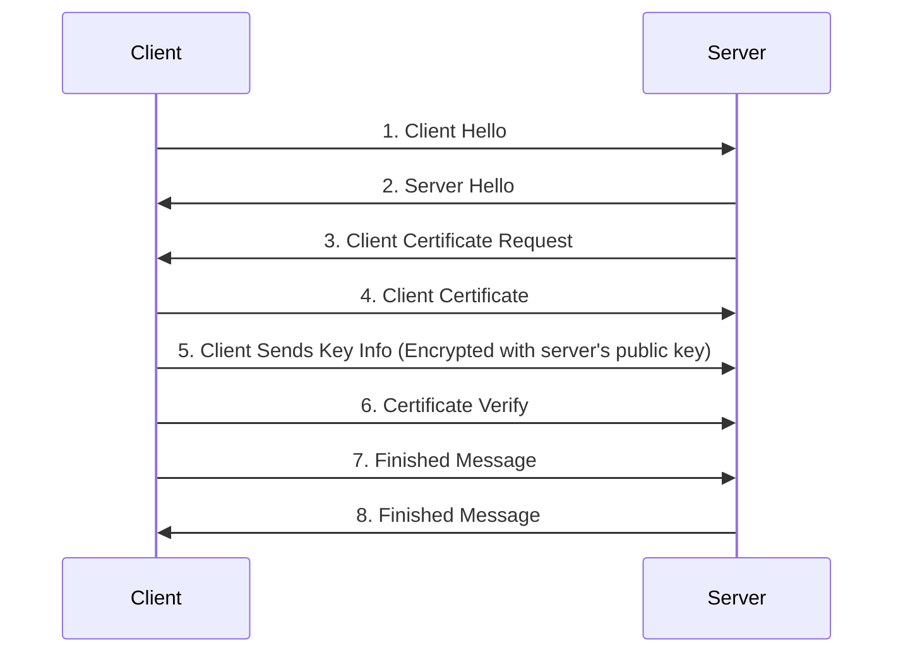

# Security

## Encryption

+ A method of encoding data so that only authorized parties can access it.
+ Does not prevent interception or interference.
+ Encryption algorithms are called **ciphers**.
+ Unencrypted data is called **plaintext**.
+ Encrypted data is called **ciphertext**.
+ A cipher takes plaintext and produces ciphertext.
+ The act of encoding plaintext with a cipher is called **encryption**.
+ Decoding ciphertext into plaintext is called **decryption**.
+ Used to send sensitive data over an insecure channel.

## Key Based Encryption

**Keys** are relatively short, pseudo-random data sequences. They are used to
both encrypt and decrypt data. There are two broad types of key based
encryption algorithms: **Symmetric** and **Asymmetric**.

## Symmetric Ciphers

A secret key is used by ciphers to produce the encrypted data, which can then
be sent over an insecure channel. The receiver uses the same secret key to
decrypt the ciphertext. But, how do we securely share the key between two or
more people? If a third party intercepts the key exchange, they can easily pose
as the sender since they now have the secret key.

## Asymmetric Ciphers

A.K.A. **Public-Key Encryption**, tries to solve the key exchange issue by
creating two mathematically related keys. One is the **public key**, which can
be openly distributed and is used to encrypt messages to the receiver. The
other is the **private key**, which only the receiver knows. It is used to
decrypt the encrypted message. This allows anyone with the public key to send
encrypted messages to the receiver, but _only_ the receiver can decrypt the
message. The private and public key pair are generated at the same time, but
it is not possible to derive one from the other.

## TLS

