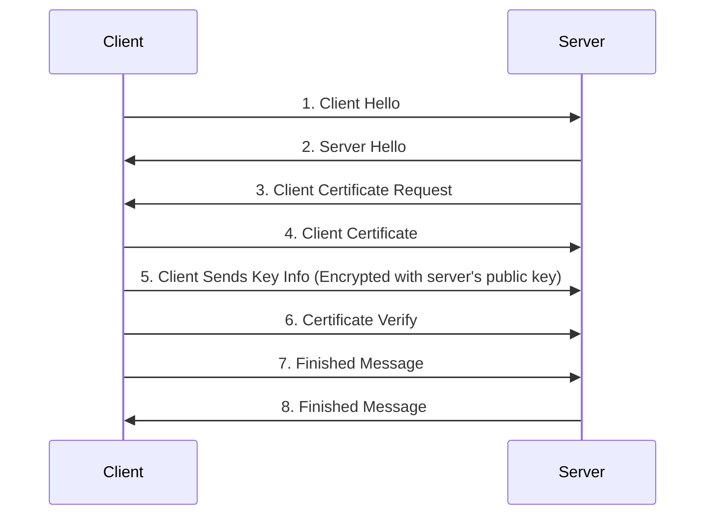

# Security

## Encryption

+ A method of encoding data so that only authorized parties can access it.
+ Does not prevent interception or interference.
+ Encryption algorithms are called **ciphers**.
+ Unencrypted data is called **plaintext**.
+ Encrypted data is called **ciphertext**.
+ A cipher takes plaintext and produces ciphertext.
+ The act of encoding plaintext with a cipher is called **encryption**.
+ Decoding ciphertext into plaintext is called **decryption**.
+ Used to send sensitive data over an insecure channel.

## Key Based Encryption

**Keys** are relatively short, pseudo-random data sequences. They are used to
both encrypt and decrypt data. There are two broad types of key based
encryption algorithms: **Symmetric** and **Asymmetric**.

## Symmetric Ciphers

A secret key is used by ciphers to produce the encrypted data, which can then
be sent over an insecure channel. The receiver uses the same secret key to
decrypt the ciphertext. But, how do we securely share the key between two or
more people? If a third party intercepts the key exchange, they can easily pose
as the sender since they now have the secret key.

## Asymmetric Ciphers

A.K.A. **Public-Key Encryption**, tries to solve the key exchange issue by
creating two mathematically related keys. One is the **public key**, which can
be openly distributed and is used to encrypt messages to the receiver. The
other is the **private key**, which only the receiver knows. It is used to
decrypt the encrypted message. This allows anyone with the public key to send
encrypted messages to the receiver, but _only_ the receiver can decrypt the
message. The private and public key pair are generated at the same time, but
it is not possible to derive one from the other.

## TLS

Once a TLS connection is established, the TLS handshake occurs. The client
sends to the server, among other things, the versions of SSL/TLS it supports,
which ciphers it knows, and which compression methods it can use. The server
selects the highest mutually supported SSL/TLS version and a cipher suite and
compression method from the list provided by the client.

## Certificates

+ Each HTTPS server uses one or more certificates to verify their identity.
+ The certificate must be trusted by the client or a third party the client
  trusts.
+ "This trust is proven using digital signatures."

# OS Security and Protection

## Don't Forget Protection

+ A mechanism for controlling the access of programs/processes or users to the
  resources provided by a computer system.
+ A protection-oriented system provides means to distinguish between authorized
  and unauthorized usage.

## Principals of Protection

+ The time-tested **Principle of Least Privilage**.
  - Programs, users, and system processes should be given _just_ enough
    privileges to perform their tasks.

## Domain of Protection

+ A computer system is a collection of processes and objects/resources.
+ Each object has a unique name and can only be accessed through well-defined
  and meaningful operations.
  - e.g. A CPU can execute, Memory can be read/written.
+ A process should only be able to access the resources it currently requires
  to complete its task. This is known as the **Need-to-Know Principle**.

## Linux Permissions

+ Determines whether a user or group has access to files, programs, or other
  resources on the system.
+ Four access types/rules:

|Symbol|Meaning|
|:----:|:-----:|
|r|Read permissions|
|w|Write permissions|
|x|Execute permissions|
|-|No permissions|

These permissions are specified for three times for each file: For the owner of
the file, the user group associated with the file, and everyone else. You can
see the permissions on a file by running `ls -l` in a terminal. One trio of
permissions (`rwx`) is read right-to-left. You'll often see them specified in
octal notation (e.g. `chmod 766 ...`), in which case, convert each digit into
binary and interpret it as a bitflag, on binary digit for each `r`, `w`, or `x`.

## Security Violations

+ **Breach of Confidentiality** - Unauthorized reading of data.
+ **Breach of Integrity** - Unauthorized modification of data.
+ **Breach of Availability** - Unauthorized destruction of data.
+ **Theft of Services** - Unauthorized use of resources.
+ **Denial of Service (DOS)** - Not MS-DOS, Prevention of legitimate use.

## Security Violation Methods

+ **Masquerading** (breach authentication) - Pretending to be an authorized
  user to escelate privileges.
+ **Replay Attack** - Valid data transmission is maliciously or fraudulently
  repeated. See Wikipedia's exellent
  [example](https://en.wikipedia.org/wiki/Replay_attack).
+ **Man-in-The-Middle Attack** - An intruder sits in the middle of data flow,
  masquerading as the sender and receiver to both sides of the connection.
+ **Session Hijacking** - Intercept an already established session to bypass
  authentication.

## Security Measure Levels

Security must occur at four levels to be effective:
+ Physical - e.g. At data centers, servers, terminals.
+ Human - Consider social engineering.
+ OS - Protection mechanisms.
+ Network - (D)DOS, intercepted communications.

## Program Level Threats

### Trojan Horse

Code segment that misuses its environment. Exploits mechanisms for allowing
programs written by users to be executed by other users. (spyware, covert
channels.)

### Stack & Buffer Overflow

+ Allows writing past argument on the stack into the return address.
  - When a routine returns from a call, it'll return to the inject address
    instead of the intended original call location.
+ Can cause unauthorized user or privilege escelation.

### Viruses

+ Code fragment embedded in legitimate program.
+ Often self replicating, designed to infect other systems.

## System & Network Threats

### Port Scanning

+ Automated attempt to connect to a range of ports.
+ Detects available protocols.
+ Detects OS (and its version).

### Denial of Service

+ Overload the targeted computer.
+ Prevents it from doing any useful work.
+ Often used as part of extortion or punishment.

## FireWalls

+ Hardware or Software that inspects packets going into or out of a network or
  computer.
+ Packets are discarded or forwarded base on a set of predefined rules.
+ Conceptually, just a router with specialized software for creating rules to
  permit or deny packets.
+ Routers are more open by default, whereas FireWalls are intended to be more
  restrictive.
+ Network Admins create **access control lists** to deny certain types of
  packets.
