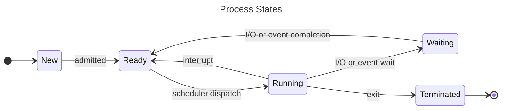
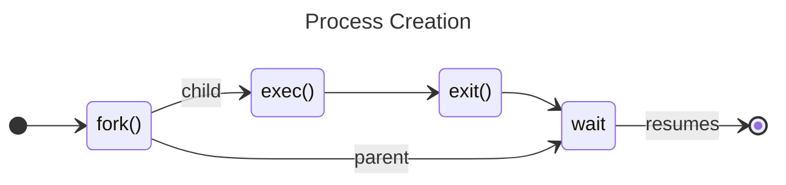

# Processes

+ A program in execution.
+ Contains program code. (Stored in the "text" section within a binary.)
+ Data section containing global variables. (This is a feature of the binary format, no?)
+ Has its own program counter and set of registers.
+ Has its own stack.
+ Has associated heap memory.

A program is a passive entity stored on disk. When it is loaded into memory
and executed, it becomes an active entity called a Process. A program on disk
can become multiple processes in memory.

|Process|
|:-----:|
| Stack |
| ..... |
| Heap  |
| Data  |
| Text  |

The Stack grows downwards and the Heap grows Upwards.

# Process States

+ **new** - The process is being created.
+ **running** - Instructions are being executed.
+ **waiting** - Execution is paused waiting for some event to occur.
+ **ready** - The process is specifically waiting to be assigned CPU time.
+ **terminated** - The process has finished execution.

# Process Scheduling

+ It is considered bad to have process wait for a long time before they get
  assigned some CPU time.
+ Effective process management translates to a "performant" computer.
+ We want to maximize CPU usage, quickly swapping in processes as others
  finish or their allocated time slice expires.

# Process Scheduler

+ Selects which process executes next on the CPU.
+ Maintains a queue of processes.
+ Various queues:
  - **Job Queue** - All processes.
  - **Ready Queue** - All processes in Main Memory in the ready state.
  - **Device Queues** - Processes waiting for an I/O device.

With a single CPU core, process must wait for their turn as only one process
can run at a time. There are various **Scheduling Argorithms** to determine
when and which process runs.

# Two Different Schedulers

## The Short-Term Scheduler (a.k.a. CPU Scheduler)

Selects which process should next be allocated some CPU time. This is sometimes
the only scheduler in the system. Invoked frequently so it should be fast.

## The Long-Term Scheduler (a.k.a. Job Scheduler)

Selects which processes should be brought into the _ready queue_. Invoked
relatively infrequently, need not be fast.

# Process Creation
Processes are identified by a `process identifier` (pid). The parent and child
can execute concurrently or the parent can wait for the child to terminate
before continuing to execute.

Parent and child processes have options when it comes to sharing resources:
+ Parent and children can share all resources.
+ Children share only a subset of resources.
+ Parent and children share no resources.

In terms of the address space:
+ The child can recieve a duplicate of the parent's.
+ The child can have a fresh program loaded into it. (`exec()`)

# Process Termination

+ Process resources are deallocated by the OS.
+ A parent may terminate a child process by using the `abort()` syscall.
+ Some OS's may not allow children processes to exist if their parent
  terminates.
+ A **zombie process** is a process who's parent is not waiting for its
  termination.
+ An **orphan process** is a process who's parent has terminated.

# Inter-Process Communication - IPC

Process may be independent or cooperative. If they are cooperative they need
some form of communication. This is what IPC is about. We look at two types
of IPC:

## Shared Memory

+ An area of memory shared among processes.
+ Communication is under control of the user processes.
+ Requires manual synchronization of communication.

| Shared Memory |
|:-------------:|
|Process A|
|_shared memory_|
|Process B|
|.....|
|.....|

## Message Passing

A system for processes to communicate and synchronize their actions. There are
two main operations in message passing: **send** and **recieve**. Message sizes
can be fixed or variable. If two processes wish to communicate, they must
establish a communication link between them. There are physical and logical
concerns for communication link implementations, here are some:

+ Physical - specifically, the medium over which message passing occurs.
  - Shared Memory
  - A Hardware Bus
  - The Network
+ Logical - We look at these in more detail.
  - Direct or indirect.
  - Synchronous or asynchronous.
  - automatic or explicit buffering.

| Message Passing |
|:---------------:|
|Process A|
|Process B|
|.....|
|.....|
|Message Queue m1, m2, m3, ...|

### Direct Communication

+ Processes must name each other directly when sending and receiving.
+ "Links" are established automatically.
+ Links are between exactly one pair of processes and there is only one link
  between a pair.
+ May be unidirectional but are usually bi-directional.

### Indirect Communication

+ Messages are sent to and received from mailboxes (or ports.)
+ Each port has a unique id.
+ Processes must share this port.
+ A port or mailbox may be associated with multiple processes.
+ unidirectional or bi-directional.

### Synchronous or Asynchronous

+ Message passing may be blocking or non-blocking.

### Automatic or Explicit Buffering

Each link has a queue of messages with differing capacities and behaviours:

+ Zero capacity - No buffering, the sender must wait for the receiver to
  receive.
+ Bounded Capacity - Finite buffering, the sender must wait if the queue is
  full.
+ Unbounded Capacity - Infinite buffering, the sender never waits.

## Relevant Functions
+ `fork()`
+ `exec()`
+ `wait()`
+ `abort()`
